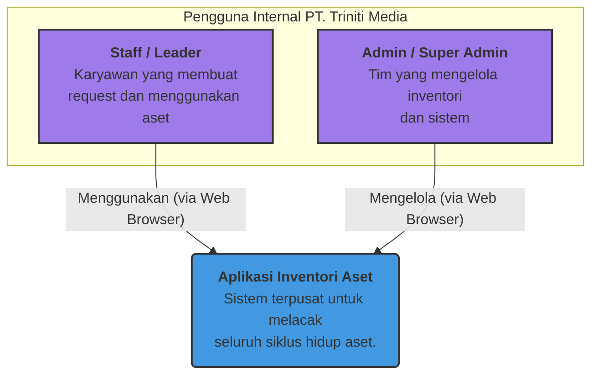
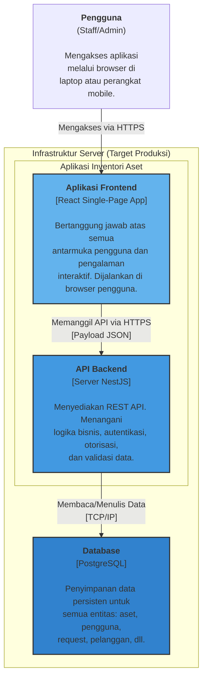
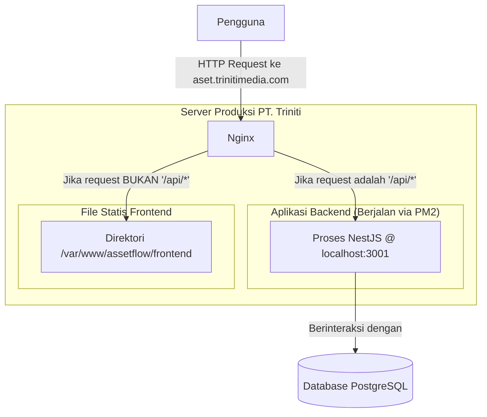
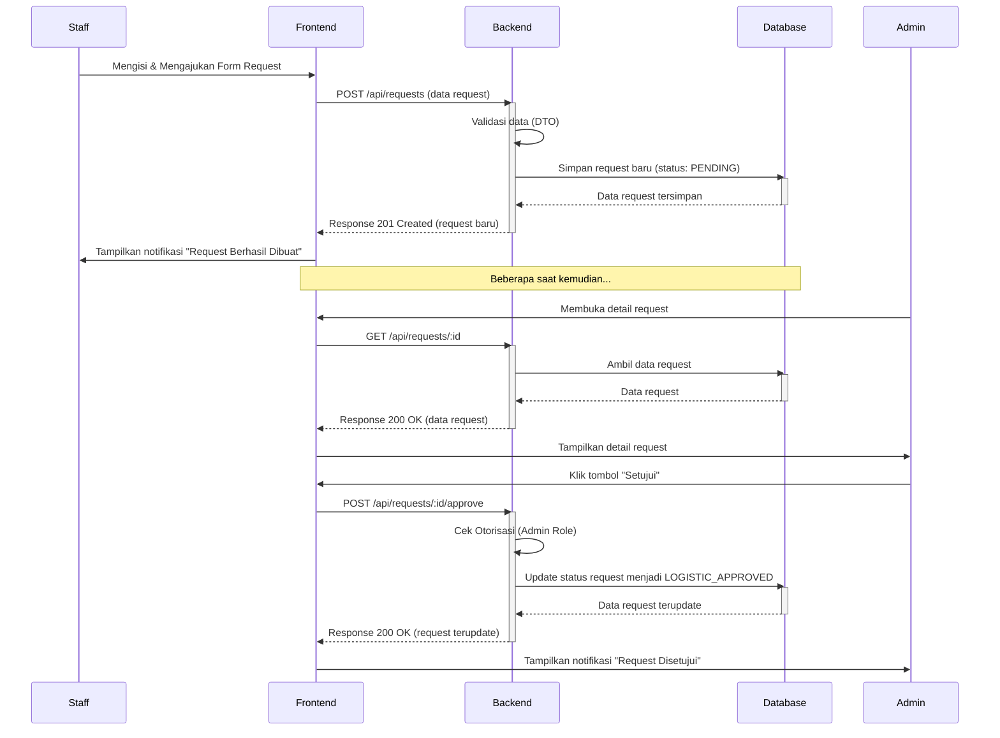

# Arsitektur Sistem & Konsep

Dokumen ini menjelaskan blueprint arsitektural tingkat tinggi dari Aplikasi Inventori Aset. Tujuannya adalah untuk memberikan pemahaman konseptual tentang bagaimana komponen-komponen utama sistem saling terhubung dan berinteraksi.

> **PENTING: Status Proyek Saat Ini**
> Arsitektur yang dijelaskan dalam dokumen ini adalah **arsitektur target** untuk aplikasi *full-stack* yang lengkap. Implementasi saat ini adalah sebuah **prototipe frontend fungsional penuh**. Logika backend dan database disimulasikan menggunakan *mock API layer* yang berjalan di browser dan menyimpan data di `localStorage`. Manajemen state dan routing saat ini diimplementasikan secara sederhana dan merupakan area utama untuk peningkatan di fase produksi, seperti yang dijelaskan dalam [Panduan Frontend](../02_DEVELOPMENT_GUIDES/FRONTEND_GUIDE.md). Dokumen ini berfungsi sebagai cetak biru untuk tim backend dalam membangun layanan sisi server.

---

## 1. Visi Arsitektur

Aplikasi ini dirancang dengan arsitektur **Client-Server** yang modern dan terpisah (_decoupled_). Ini memungkinkan pengembangan, penskalaan, dan pemeliharaan yang independen antara antarmuka pengguna (Frontend) dan logika bisnis (Backend).

-   **Frontend (Client)**: Aplikasi React yang berjalan di browser pengguna. Bertanggung jawab penuh atas UI/UX, menampilkan data, dan menangkap input pengguna.
-   **Backend (Server)**: Aplikasi NestJS yang berjalan di server. Bertanggung jawab atas logika bisnis, validasi data, keamanan, dan interaksi dengan database.
-   **Database**: PostgreSQL sebagai penyimpan data persisten.
-   **Komunikasi**: Frontend dan Backend berkomunikasi melalui **REST API** yang aman menggunakan format JSON.

Untuk detail teknologi yang digunakan, silakan lihat dokumen [**Tumpukan Teknologi**](./TECHNOLOGY_STACK.md).

---

## 2. Arsitektur Logis (C4 Model)

Diagram berikut menggunakan notasi C4 untuk memvisualisasikan arsitektur dalam berbagai tingkat detail.

### Level 1: Diagram Konteks Sistem

Diagram ini menunjukkan gambaran besar: bagaimana sistem Aplikasi Inventori Aset akan berinteraksi dengan penggunanya di dalam perusahaan.

### Level 2: Diagram Kontainer

Diagram ini memperbesar "Aplikasi Inventori Aset" untuk menunjukkan komponen-komponen teknis utama di dalamnya.

---

## 3. Komunikasi API & Alat Pengembang

Komunikasi antara Frontend (ruang makan) dan Backend (dapur) terjadi melalui serangkaian "pesanan" standar yang disebut **API**. Untuk memastikan "dapur" berfungsi dengan sempurna bahkan sebelum "ruang makan" siap, tim pengembang menggunakan alat khusus.

> **Analogi**: Bayangkan **Postman** sebagai **stetoskop** bagi dokter (pengembang backend). Dokter menggunakannya untuk memeriksa kesehatan organ dalam (API backend) secara langsung, tanpa harus menunggu laporan dari pasien (antarmuka frontend). Ini memungkinkan pengujian dan diagnosis yang cepat dan akurat selama proses pengembangan. **Pengguna akhir atau klien tidak memerlukan alat ini.**

---

## 4. Arsitektur Fisik & Target Deployment

Bagian ini menjelaskan bagaimana komponen-komponen di atas akan di-deploy dan berinteraksi di lingkungan server produksi. Model ini menggunakan **Reverse Proxy** untuk menyajikan frontend dan backend di bawah satu domain tunggal, yang merupakan praktik industri terbaik untuk keamanan dan efisiensi.

### Konsep Utama
- **Frontend**: Setelah proses _build_, aplikasi frontend menjadi sekumpulan file statis (HTML, CSS, JavaScript). File-file ini hanya perlu "disajikan" oleh web server.
- **Backend**: Aplikasi backend adalah proses Node.js yang berjalan secara terus-menerus di server pada port internal (misalnya, `3001`).
- **Nginx (Reverse Proxy)**: Bertindak sebagai "penerima tamu" atau gerbang utama. Nginx akan menerima semua permintaan dari pengguna dan secara cerdas memutuskan ke mana permintaan itu harus diteruskan.

### Alur Kerja di Produksi
1. Pengguna mengakses domain utama (misal: `http://aset.trinitimedia.com`).
2. Nginx menerima permintaan tersebut.
3. **Jika permintaan adalah untuk API** (misalnya, `.../api/assets`), Nginx akan meneruskannya secara internal ke aplikasi backend yang berjalan di `localhost:3001`.
4. **Jika permintaan BUKAN untuk API** (misalnya, halaman utama, gambar, CSS), Nginx akan menyajikan file statis dari direktori frontend.

Dengan cara ini, dari sudut pandang pengguna, seluruh aplikasi tampak berjalan dari satu server tunggal, padahal di belakang layar ada dua aplikasi berbeda yang bekerja sama.

**Diagram Alur Produksi:**

Untuk panduan implementasi teknis dari arsitektur ini, silakan merujuk ke [**Panduan Deployment**](../04_OPERATIONS/DEPLOYMENT.md).

---

## 5. Alur Data Utama

### 5.1. Proses Request Aset

Diagram berikut menggambarkan alur data dan interaksi antar komponen saat seorang staf membuat permintaan aset baru hingga disetujui.

---

## 6. Referensi Lanjutan

Untuk detail implementasi yang lebih spesifik, silakan merujuk ke dokumen berikut:

-   [**Panduan Diagram Sistem**](./SYSTEM_DIAGRAMS.md)
-   [**Panduan Pengembangan Frontend**](../02_DEVELOPMENT_GUIDES/FRONTEND_GUIDE.md)
-   [**Panduan Pengembangan Backend**](../02_DEVELOPMENT_GUIDES/BACKEND_GUIDE.md)
