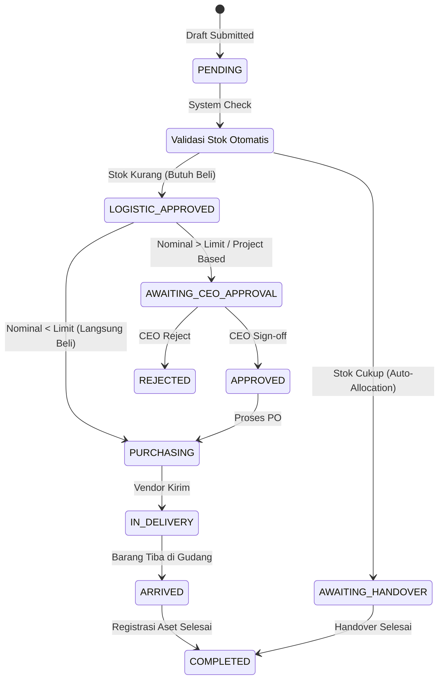
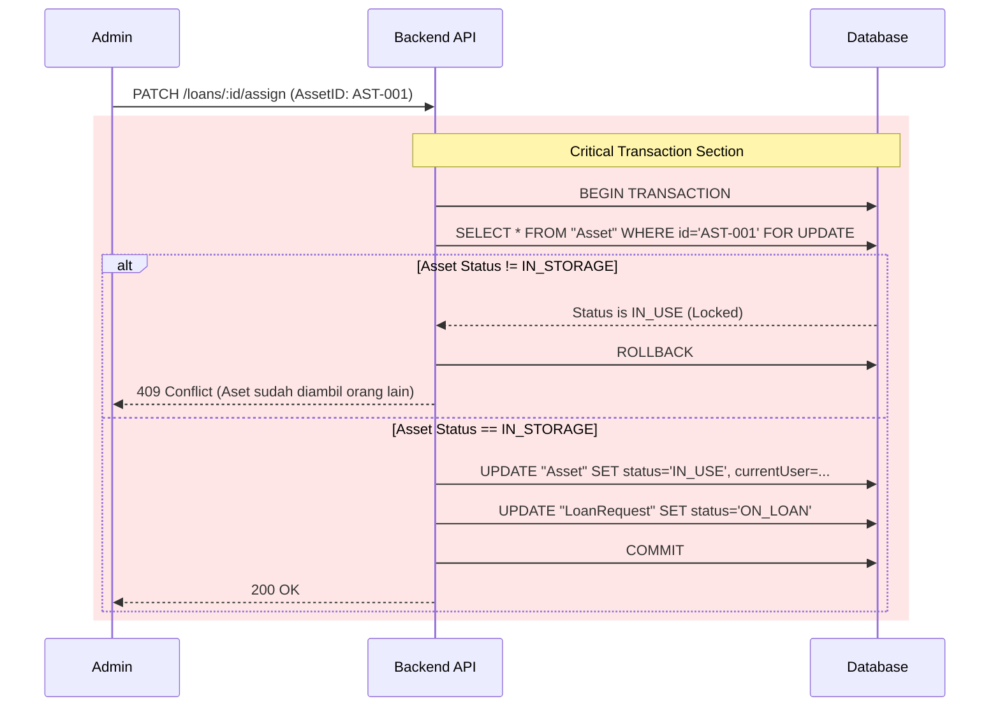
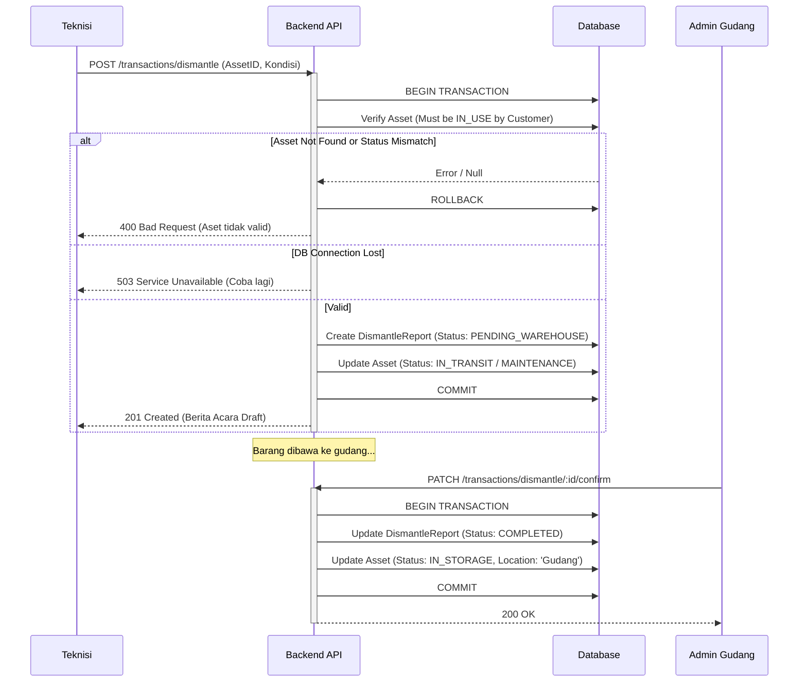
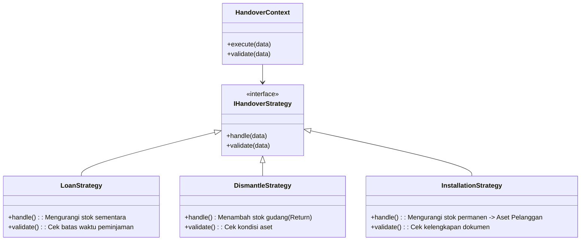

# Alur Logika Bisnis & Fungsional (End-to-End)

Dokumen ini memetakan alur kerja pengguna (User Flow) dan logika sistem (System Logic) untuk modul-modul kritis dalam TrinityApps. Dokumen ini berfungsi sebagai acuan utama bagi pengembang Backend untuk mengimplementasikan *Business Rules*, *State Management*, dan penanganan *Edge Cases*.

---

## 1. Modul Pengadaan (Procurement & Request)

Modul ini menangani siklus hidup permintaan barang baru, mulai dari pengajuan oleh staf hingga barang tiba dan dicatat.

### 1.1. Diagram Transisi Status (Request Lifecycle)



### 1.2. Panduan Siklus Hidup Transaksi (Transaction Lifecycle Guide)

Tabel berikut merinci setiap langkah teknis dari Frontend hingga Database.

| Tahap | Lajur Pengguna (Frontend) | Lajur Logika (Backend Service) | Edge Cases & Validasi (Negative Path) |
| :--- | :--- | :--- | :--- |
| **1. Pengajuan** | Staf memilih item dan kuantitas. Klik "Ajukan". | 1. Terima DTO `CreateRequest`.<br>2. **Atomic Transaction**: Query tabel `Asset` (status: `IN_STORAGE`) untuk cek ketersediaan.<br>3. Jika stok >= request, set status item `STOCK_ALLOCATED`.<br>4. Jika kurang, set `PROCUREMENT_NEEDED`. | **Validasi Gagal**: Payload kosong atau qty <= 0 (Return `400 Bad Request`).<br>**DB Timeout**: Jika koneksi DB putus saat hitung stok, return `503 Service Unavailable` dan jangan simpan request. |
| **2. Review Logistik** | Admin Logistik melihat request PENDING. Mengedit qty jika perlu. Klik "Approve". | 1. Update status request -> `LOGISTIC_APPROVED`.<br>2. Trigger notifikasi WhatsApp ke grup Purchasing.<br>3. Jika ada revisi qty, catat di `ActivityLog`. | **Rejection**: Jika semua item ditolak (qty=0), status otomatis transisi ke `REJECTED`.<br>**Race Condition**: Jika User membatalkan request saat Admin sedang review, Backend harus cek status terakhir sebelum commit. |
| **3. Pembelian** | Admin Purchase input data PO, Vendor, Harga. Klik "Mulai Pengadaan". | 1. Validasi kelengkapan data pembelian (Harga > 0, Vendor terisi).<br>2. Update status -> `PURCHASING`. | **Validation**: Tanggal beli tidak boleh di masa depan (kecuali pre-order). |
| **4. Penerimaan (Staging)** | Admin Logistik klik "Barang Tiba". Membuka menu Staging. | 1. Update status -> `ARRIVED`.<br>2. Siapkan data *pre-fill* untuk registrasi aset. | **Partial Arrival**: Jika barang baru datang sebagian, sistem harus mendukung *splitting* status (Fitur Fase 2). Saat ini tandai `ARRIVED` hanya jika semua lengkap. |
| **5. Konversi Aset** | Admin input SN/Mac Address. Klik "Simpan Aset". | 1. **Db Transaction**: <br>   a. Create `Asset` baru.<br>   b. Update `Request` (isRegistered = true, status = `COMPLETED`).<br>   c. Create `ActivityLog` (Asset Created). | **Duplicate SN**: Jika SN sudah ada di DB (Unique Constraint Violation), rollback seluruh transaksi dan return error ke UI. Request tetap `ARRIVED`. |

---

## 2. Modul Peminjaman (Loan & Assignment)

Mengatur peminjaman aset dari gudang ke staf (sementara) atau handover permanen.

### 2.1. Logic Flow: Pencegahan Race Condition (Critical)

Masalah utama dalam sistem inventori adalah dua admin mencoba menetapkan aset fisik yang sama (misal: ID `AST-001`) kepada dua pemohon berbeda pada waktu yang hampir bersamaan.

**Skenario Kegagalan (Tanpa Locking):**
1. Admin A membuka form Assign untuk Request X. Melihat `AST-001` tersedia.
2. Admin B membuka form Assign untuk Request Y. Melihat `AST-001` tersedia.
3. Admin A submit. `AST-001` update ke `IN_USE`.
4. Admin B submit. `AST-001` di-overwrite menjadi milik Request Y.
5. **Hasil**: Data korup. Satu aset dipinjam dua orang.

**Solusi Backend (Pessimistic Locking / Atomic Update):**



### 2.2. Implementasi Kode (Prisma)

Gunakan `interactiveTransactions` atau raw query untuk locking jika beban tinggi. Untuk beban menengah, validasi atomik dalam `$transaction` biasanya cukup:

```typescript
// backend/src/loans/loans.service.ts
await prisma.$transaction(async (tx) => {
    // 1. Cek ulang status aset di dalam transaksi yang sama
    const asset = await tx.asset.findUniqueOrThrow({ where: { id: assetId } });
    
    if (asset.status !== 'IN_STORAGE') {
        throw new ConflictException(`Aset ${asset.name} baru saja diambil oleh user lain.`);
    }

    // 2. Lakukan update jika aman
    await tx.asset.update({ ... });
    await tx.loanRequest.update({ ... });
});
```

---

## 3. Modul Instalasi & Dismantle (Sirkulasi Pelanggan)

Alur pergerakan aset keluar ke pelanggan dan kembali lagi ke gudang.

### 3.1. Sequence Diagram: Dismantle (Penarikan) dengan Skenario Gagal

Proses ini melibatkan pemindahan tanggung jawab dari Pelanggan -> Teknisi -> Gudang.



### 3.2. Penanganan Pengecualian (Exception Handling)

| Skenario Error | Respon Sistem | Tindakan Pengguna |
| :--- | :--- | :--- |
| **Koneksi DB Terputus** saat Submit | Return `503 Service Unavailable` | Frontend menampilkan pesan "Koneksi terputus, data tersimpan di draft lokal (jika PWA). Coba lagi." |
| **Aset Tidak Ditemukan** (QR Code salah) | Return `404 Not Found` | Frontend meminta user scan ulang atau input manual ID. |
| **Pelanggan Suspend** | Return `200 OK` (Warning) | Sistem tetap mengizinkan Dismantle (pemulihan aset prioritas), tapi memberi flag `warning` pada laporan. |
| **Stok Material Habis** saat Instalasi | Return `409 Conflict` | Teknisi tidak bisa submit BA Instalasi sampai stok material di-restock di sistem, atau gunakan opsi "Material Darurat". |

---

## 4. Modul Perbaikan (Maintenance & Repair)

### 4.1. Transisi Status Perbaikan & Audit Trail

Setiap perpindahan status perbaikan harus meninggalkan jejak audit yang tidak bisa dihapus.

1.  `IN_USE` -> `DAMAGED`: User melapor. (Log: "User reported damage: [Description]")
2.  `DAMAGED` -> `UNDER_REPAIR`: Admin memulai perbaikan internal. (Log: "Started repair by [Technician]")
3.  `DAMAGED` -> `OUT_FOR_REPAIR`: Dikirim ke vendor. (Log: "Sent to Vendor [Name]")
4.  `OUT_FOR_REPAIR` -> `IN_STORAGE`: Aset kembali baik. (Log: "Received from Vendor. Cost: [Rp XXX]")
5.  `UNDER_REPAIR` -> `DECOMMISSIONED`: Aset mati total. (Log: "Written off. Reason: [Reason]")

**Aturan Data**: Field `repairCost` bersifat kumulatif atau dicatat per insiden `MaintenanceLog`. Jangan hanya update field di tabel `Asset`.

### 4.2. Logika Biaya & Capex
*   Backend harus memisahkan antara biaya *Operational Expenditure (Opex)* untuk perbaikan ringan, dan *Capital Expenditure (Capex)* jika perbaikan tersebut menambah umur ekonomis aset (misal: ganti mesin utama).
*   Jika Capex, backend harus mentrigger kalkulasi ulang depresiasi (fitur masa depan).

---

## 5. Peta Logika Handover (Strategy Pattern)

Kode sumber: `src/features/handover/logic/strategies/*.ts`

Sistem menggunakan **Strategy Pattern** di sisi Frontend untuk menangani berbagai jenis serah terima aset secara dinamis, tergantung dari sumber datanya (Request Baru, Pinjaman, Instalasi, dll).


