# Alur Fitur & Workflow Aplikasi

Dokumen ini menjelaskan alur kerja (workflow) lengkap untuk setiap fitur utama dalam aplikasi. Setiap diagram menunjukkan langkah-langkah yang harus diikuti pengguna dan sistem untuk menyelesaikan suatu tugas.

---

## 1. Modul Request & Procurement

### 1.1. Alur Request Aset Baru (End-to-End)

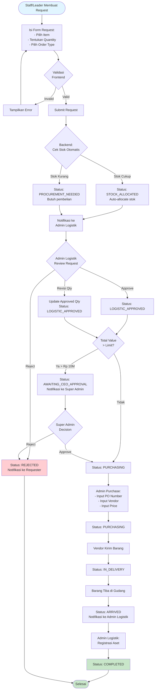

### 1.2. Alur Approval Request (Detail)

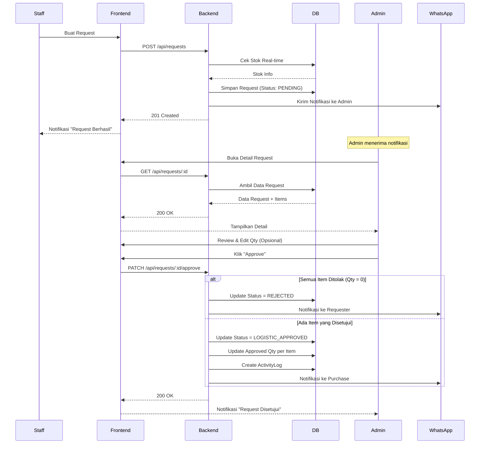

---

## 2. Modul Loan & Handover

### 2.1. Alur Peminjaman Aset

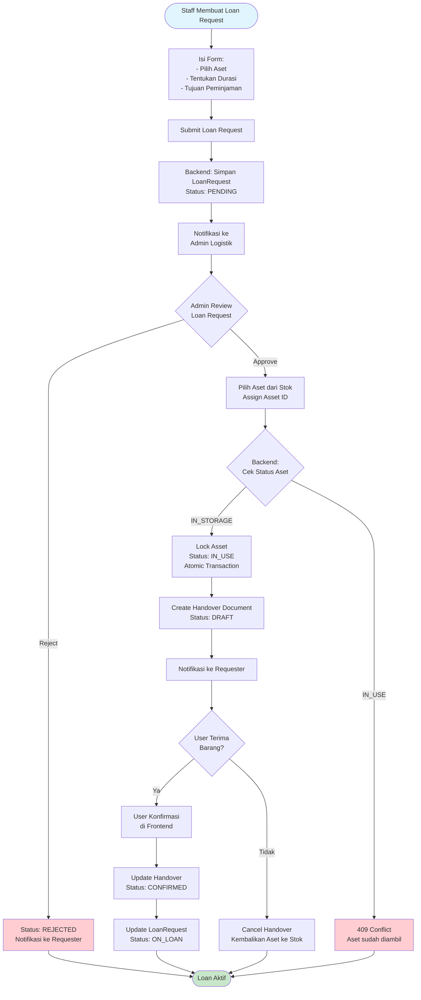

### 2.2. Alur Return Aset (Pengembalian)

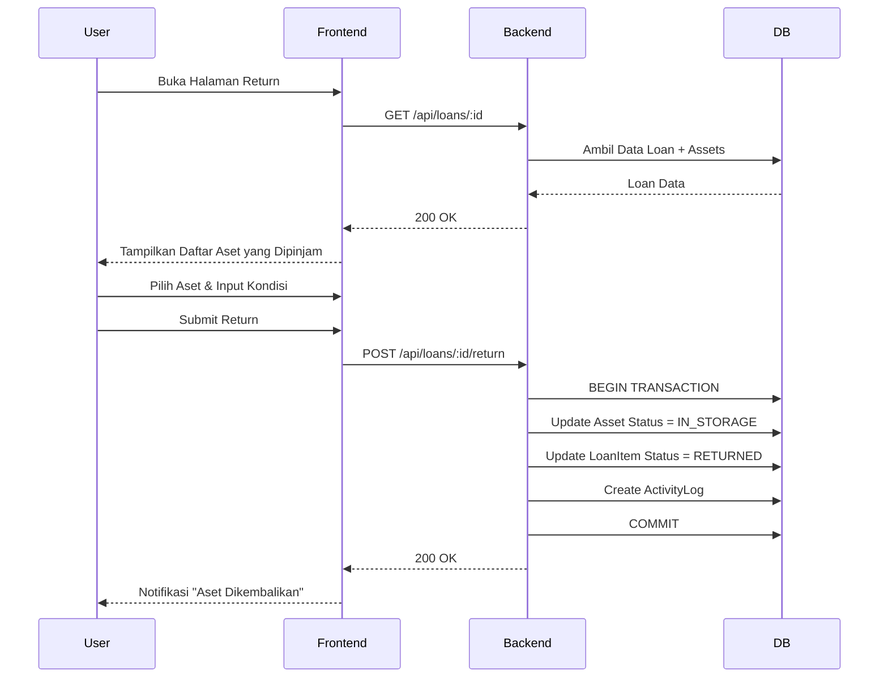

---

## 3. Modul Instalasi & Dismantle

### 3.1. Alur Instalasi ke Pelanggan

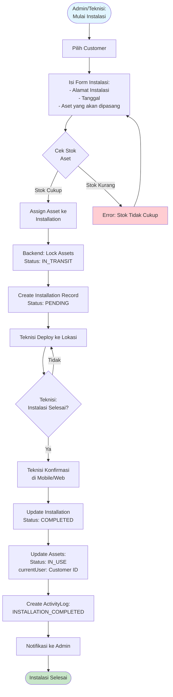

### 3.2. Alur Dismantle (Penarikan dari Pelanggan)

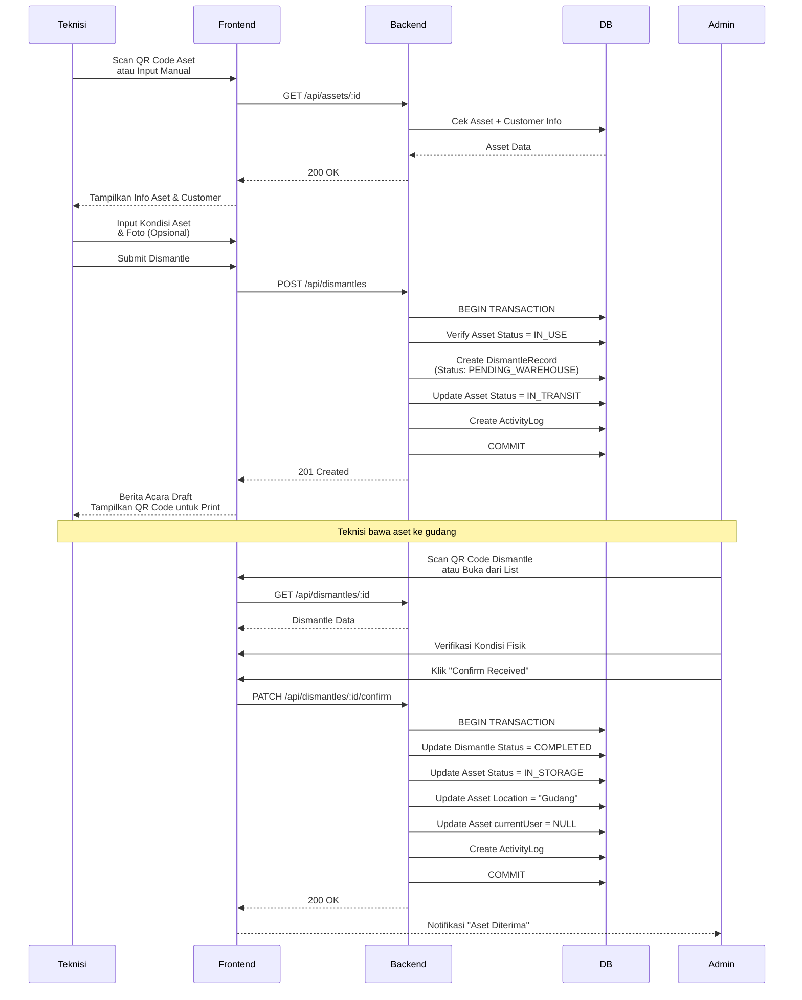

---

## 4. Modul Maintenance & Repair

### 4.1. Alur Perbaikan Aset

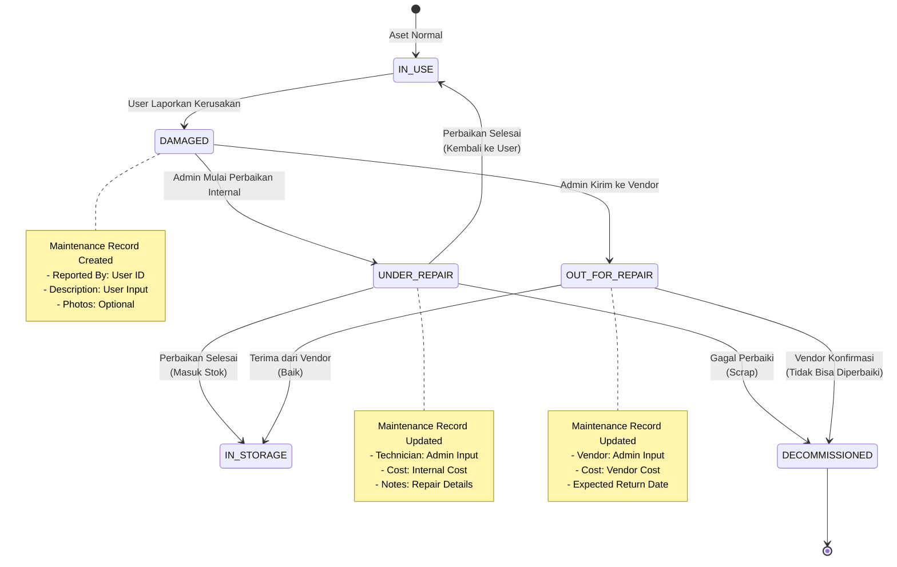

### 4.2. Sequence Diagram: Report Damage

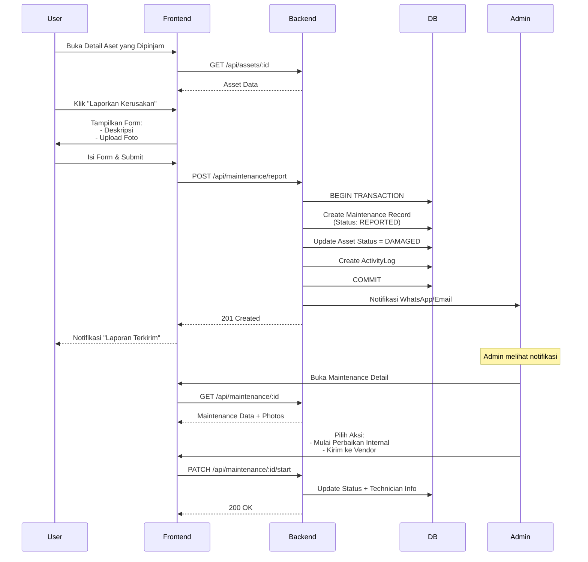

---

## 5. Modul Asset Registration

### 5.1. Alur Registrasi Aset Baru

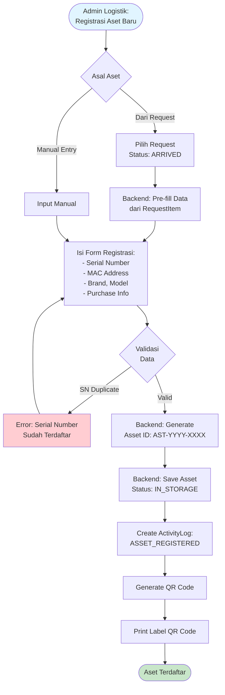

### 5.2. Alur Bulk Registration

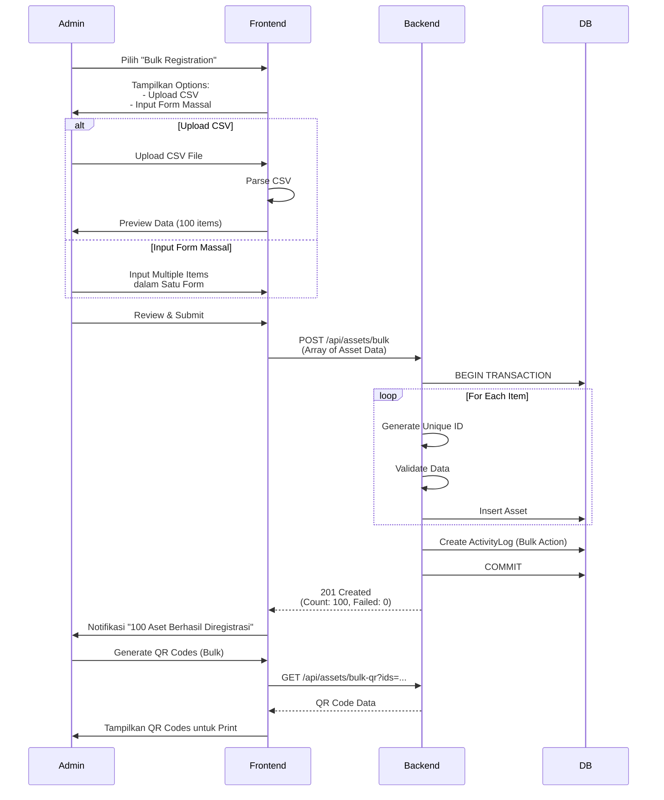

---

## 6. Modul Dashboard & Reporting

### 6.1. Alur Generate Report

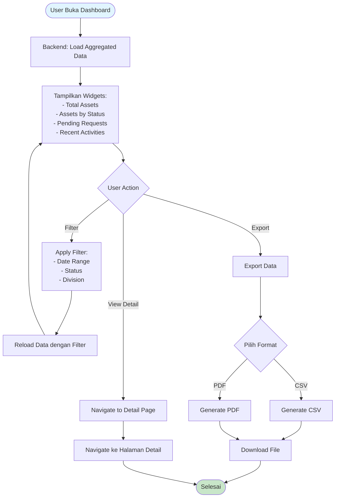

---

## 7. Catatan Penting

### 7.1. Atomic Transactions
Semua operasi yang mengubah status aset atau membuat relasi harus dilakukan dalam **atomic transaction** untuk mencegah race condition dan data inconsistency.

### 7.2. Activity Logging
Setiap perubahan status penting harus dicatat di `ActivityLog` untuk audit trail.

### 7.3. Notifications
Sistem harus mengirim notifikasi (WhatsApp/Email) pada milestone penting:
- Request dibuat → Notifikasi ke Admin
- Request disetujui/ditolak → Notifikasi ke Requester
- Aset di-assign → Notifikasi ke User
- Maintenance dilaporkan → Notifikasi ke Admin

### 7.4. Error Handling
Setiap alur harus memiliki error handling yang jelas:
- Validasi input
- Database constraint violations
- Race conditions
- Network errors

---

## 8. Referensi

- [Business Logic Flows](./BUSINESS_LOGIC_FLOWS.md) - Detail logika bisnis
- [Database Schema](./DATABASE_SCHEMA.md) - Struktur database
- [API Reference](../02_DEVELOPMENT_GUIDES/API_REFERENCE.md) - Endpoint API

