# Alur Data Sistem (System Data Flow)

Dokumen ini menjelaskan bagaimana data mengalir melalui sistem dari input user hingga penyimpanan di database, termasuk transformasi dan validasi di setiap layer.

---

## 1. Data Flow Overview

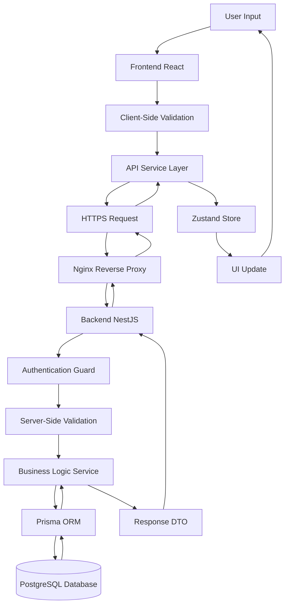

---

## 2. Detailed Data Flow per Feature

### 2.1. Create Request Flow

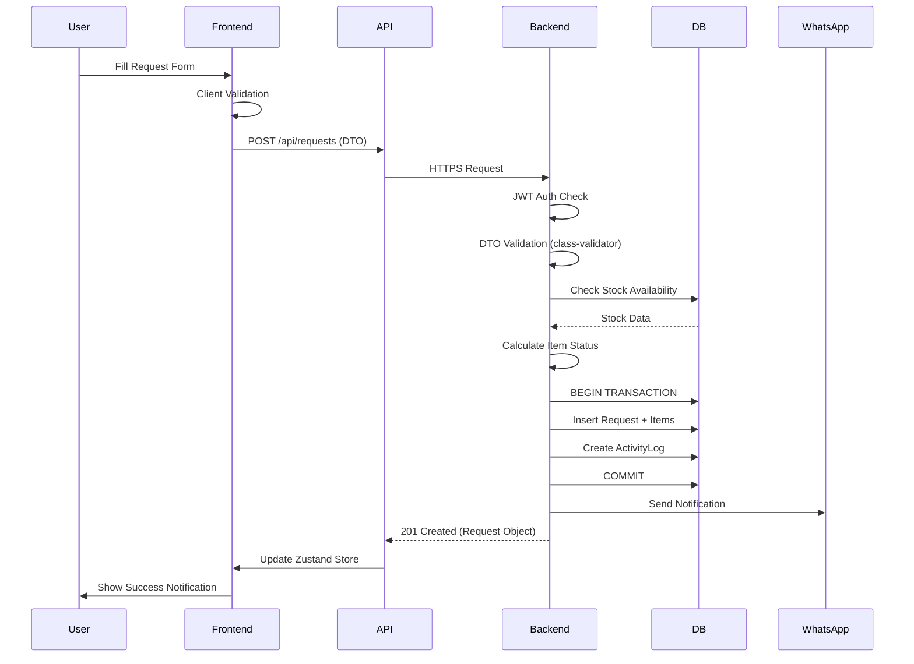

### 2.2. Approve Request Flow

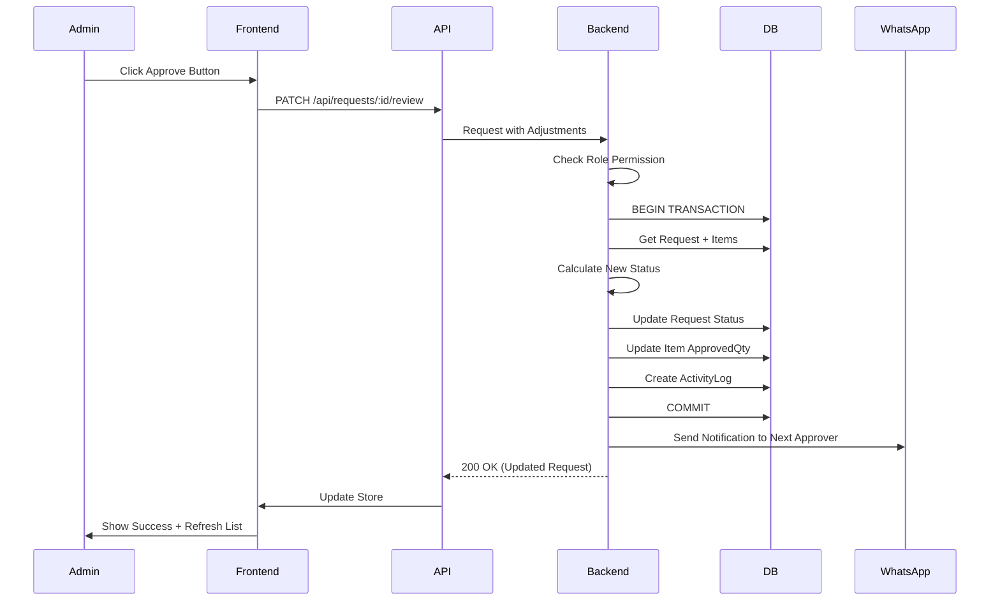

### 2.3. Register Asset Flow

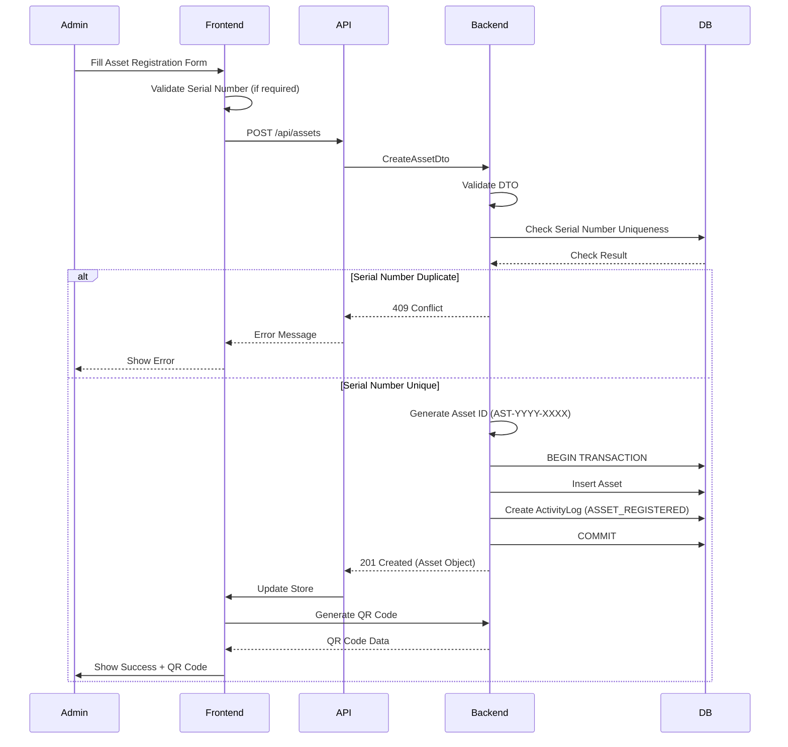

---

## 3. State Management Flow

### 3.1. Zustand Store Update Flow

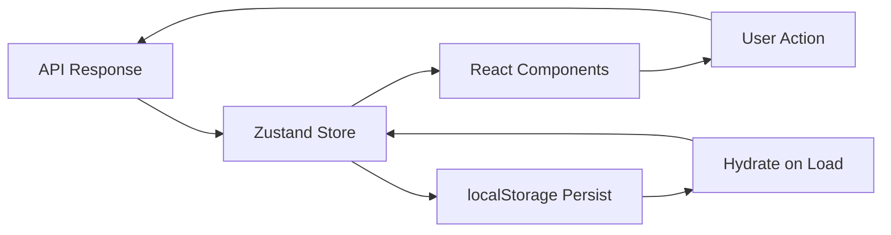

### 3.2. Store Synchronization

- **Initial Load**: Fetch all data saat aplikasi pertama kali load
- **Optimistic Updates**: Update UI immediately, sync dengan server
- **Error Handling**: Rollback jika server update gagal
- **Persistence**: Store state di localStorage untuk persist across sessions

---

## 4. Database Transaction Flow

### 4.1. Atomic Operations

Semua operasi yang mengubah multiple entities harus dalam transaction:

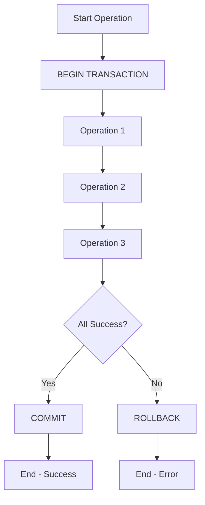

### 4.2. Example: Loan Approval Transaction

```typescript
// Atomic transaction untuk approve loan
await prisma.$transaction(async (tx) => {
  // 1. Lock assets (FOR UPDATE)
  const assets = await tx.asset.findMany({
    where: { id: { in: assetIds } },
    for: 'update' // Pessimistic locking
  });
  
  // 2. Verify all assets are IN_STORAGE
  const unavailable = assets.filter(a => a.status !== 'IN_STORAGE');
  if (unavailable.length > 0) {
    throw new ConflictException('Some assets are not available');
  }
  
  // 3. Update assets
  await tx.asset.updateMany({
    where: { id: { in: assetIds } },
    data: { status: 'IN_USE', currentUser: userId }
  });
  
  // 4. Update loan request
  await tx.loanRequest.update({
    where: { id: loanId },
    data: { status: 'APPROVED' }
  });
  
  // 5. Create handover
  await tx.handover.create({ data: {...} });
  
  // 6. Create activity logs
  await tx.activityLog.createMany({ data: logs });
});
```

---

## 5. Caching Strategy

### 5.1. Frontend Caching (Zustand)

- **Store Cache**: Data di Zustand store sebagai cache
- **TTL**: Tidak ada TTL, cache invalidated saat:
  - User action (create/update/delete)
  - Manual refresh
  - Logout/login

### 5.2. Backend Caching (Future)

- **API Response Cache**: Cache untuk data yang jarang berubah
- **Database Query Cache**: Cache untuk expensive queries
- **Cache Invalidation**: Invalidate saat data berubah

---

## 6. Error Propagation Flow

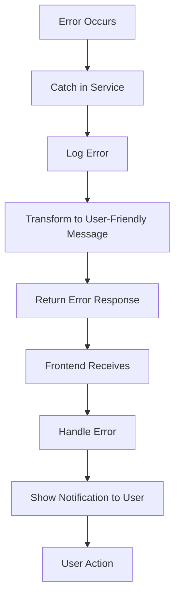

### 6.1. Error Handling Layers

1. **Database Layer**: Database errors (constraint violations, connection errors)
2. **Service Layer**: Business logic errors (validation, business rules)
3. **Controller Layer**: HTTP errors (status codes)
4. **Frontend Layer**: User-friendly error messages

---

## 7. Notification Flow

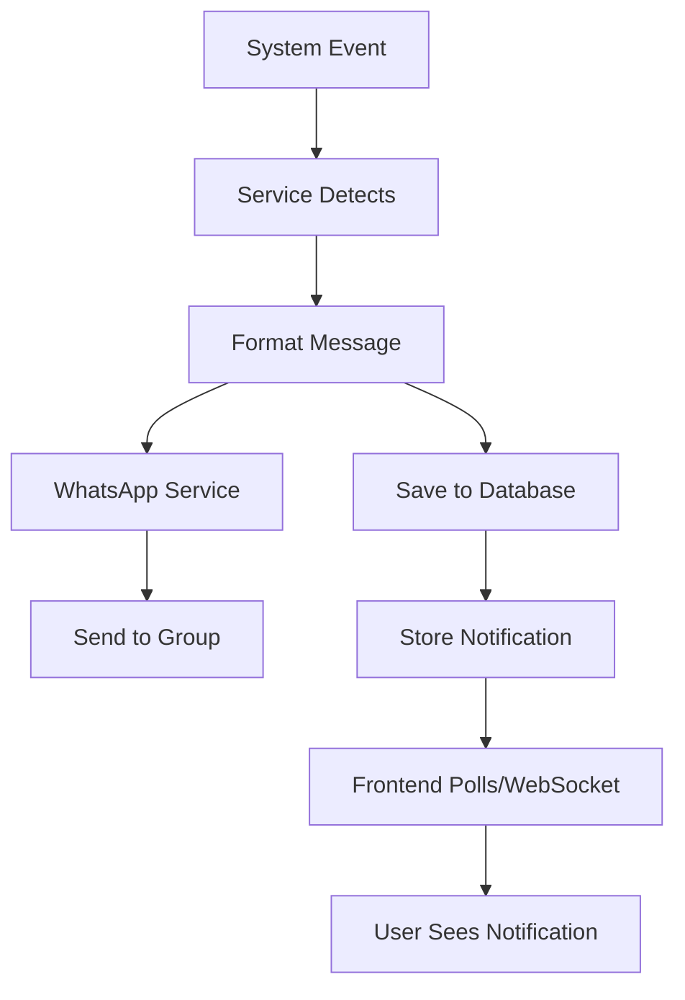

### 7.1. Notification Events

- Request created → Notify Admin Logistik
- Request approved → Notify Requester
- Request rejected → Notify Requester
- Asset assigned → Notify User
- Maintenance reported → Notify Admin Logistik
- Dismantle pending → Notify Admin Gudang

---

## 8. Search & Filter Flow

### 8.1. Frontend Search

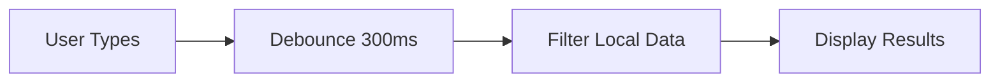

### 8.2. Backend Search

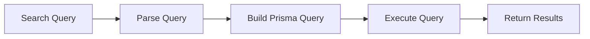

---

## 9. File Upload Flow (Future)

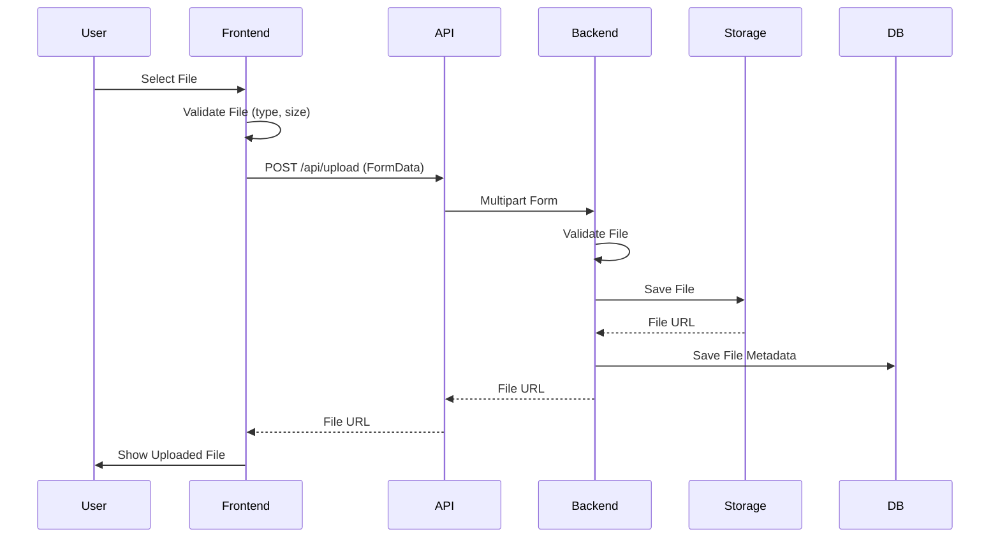

---

## 10. Real-time Updates (Future)

### 10.1. WebSocket Flow

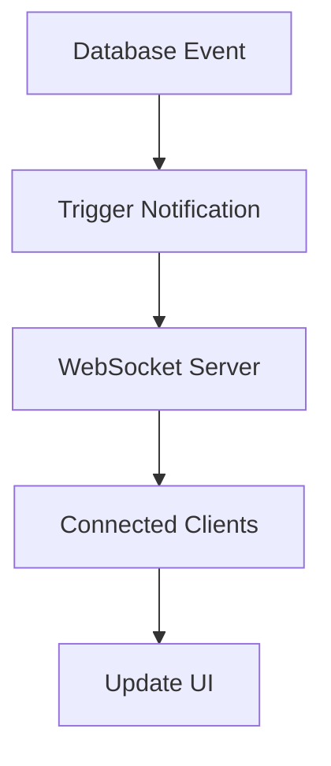

### 10.2. Polling (Current)

- Frontend polls untuk notifications setiap 30 detik
- Poll endpoint: `GET /api/notifications?unreadOnly=true`

---

## 11. Data Validation Flow

### 11.1. Multi-Layer Validation

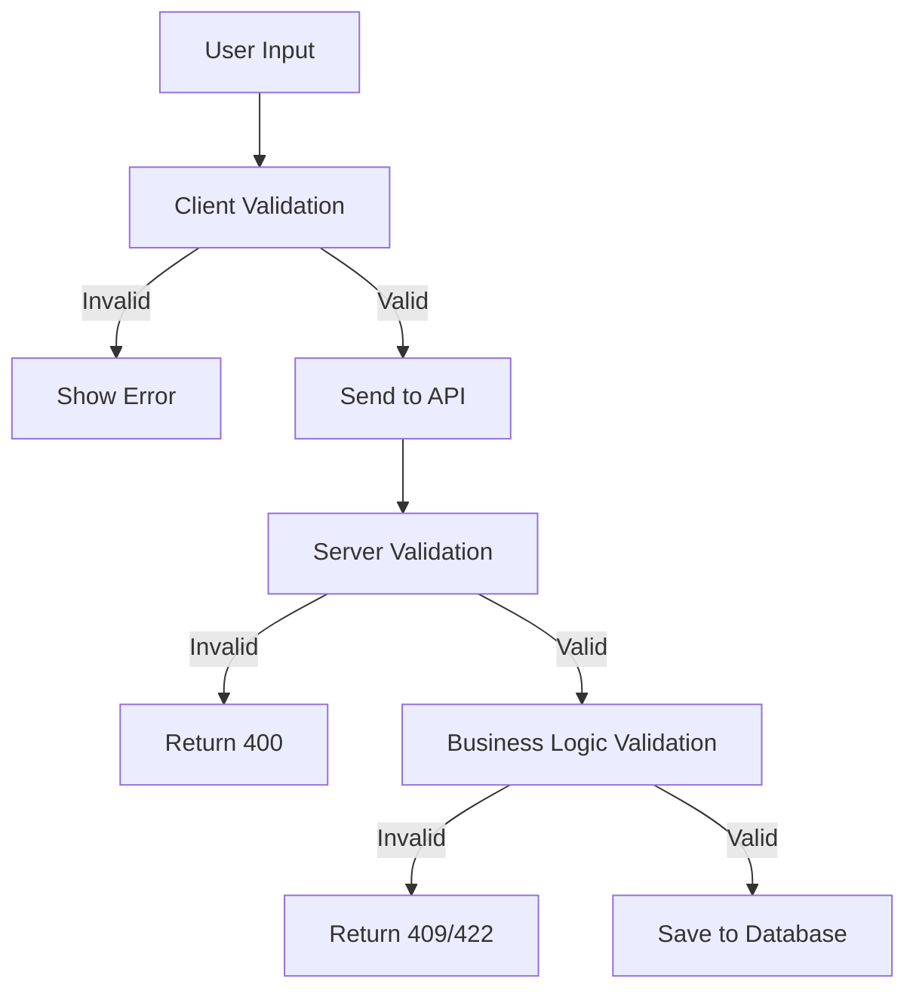

### 11.2. Validation Rules

**Client-Side (Frontend)**:
- Required fields
- Format validation (email, date)
- Basic business rules (quantity > 0)

**Server-Side (Backend)**:
- All client validations
- Database constraints
- Business logic rules
- Authorization checks

---

## 12. References

- [Architecture](./ARCHITECTURE.md) - Arsitektur sistem
- [Technical Blueprint](./TECHNICAL_BLUEPRINT.md) - Detail implementasi
- [Feature Flows](./FEATURE_FLOWS.md) - Alur fitur lengkap

---

**Last Updated**: 2025-01-XX

