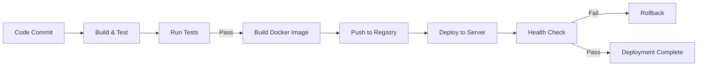

# Cetak Biru Teknis (Technical Blueprint)

Dokumen ini menjelaskan detail implementasi teknis untuk arsitektur *Client-Server* antara Frontend React dan Backend NestJS.

---

## 1. Data Flow Diagram (DFD) Level 2

Diagram ini menggambarkan bagaimana data mengalir dari interaksi pengguna hingga ke persistensi database.

```mermaid
graph TD
    User((Pengguna))
    
    subgraph "Frontend Layer (Client)"
        UI[React Components]
        Store[Zustand Store]
        ApiClient[Api Service Layer]
    end
    
    subgraph "Network & Security Layer"
        Nginx[Nginx Reverse Proxy]
        AuthGuard[JWT Auth Guard]
        Validator[Class Validator Pipe]
    end
    
    subgraph "Backend Layer (Server)"
        Controller[NestJS Controller]
        Service[Business Logic Service]
        Prisma[Prisma ORM Client]
    end
    
    subgraph "Data Layer"
        DB[(PostgreSQL)]
    end

    User -->|Klik Aksi| UI
    UI -->|Dispatch Action| Store
    Store -->|Call API| ApiClient
    
    ApiClient -.->|Dev Mode| LocalStorage[(Mock Data)]
    ApiClient -->|Prod Mode (HTTPS)| Nginx
    
    Nginx -->|Forward| AuthGuard
    AuthGuard -- Valid --> Validator
    Validator -- Valid DTO --> Controller
    
    Controller -->|Call Method| Service
    Service -->|Transaction| Prisma
    Prisma -->|SQL Query| DB
    
    DB -->|Result| Prisma
    Prisma -->|Entity| Service
    Service -->|Response DTO| Controller
    Controller -->|JSON| UI
```

---

## 2. Strategi Migrasi: Mock API ke Real API

Transisi dari prototipe ke produksi membutuhkan penggantian lapisan data tanpa merusak UI.

### 2.1. Abstraksi Layanan API
Saat ini, `src/services/api.ts` menangani logika mock.

**Langkah 1: Interface Pattern**
Buat interface standar untuk semua panggilan API untuk memastikan kontrak data tidak berubah.
```typescript
// src/services/interfaces.ts
export interface IAssetService {
    getAssets(): Promise<Asset[]>;
    createAsset(data: CreateAssetDto): Promise<Asset>;
    // ...
}
```

**Langkah 2: Implementasi Real API**
Buat `src/services/api.real.ts` yang menggunakan `axios` atau `fetch`.
```typescript
import axios from 'axios';
const client = axios.create({ baseURL: import.meta.env.VITE_API_URL });

export const RealAssetService = {
    getAssets: async () => {
        const { data } = await client.get('/assets');
        return data.data; // Unrap response standar (misal { data: [], meta: {} })
    }
}
```

**Langkah 3: Switching Mechanism (Feature Flag)**
Di `src/services/api.ts`, gunakan environment variable untuk menentukan sumber data.

```typescript
// src/services/api.ts
const USE_MOCK = import.meta.env.VITE_USE_MOCK === 'true';

// Export dinamis
export const fetchAllData = USE_MOCK ? MockService.fetchAllData : RealService.fetchAllData;
```

### 2.2. Sinkronisasi Data Awal
Data yang sudah diinput user di prototipe (LocalStorage) harus bisa dimigrasikan ke PostgreSQL agar tidak hilang saat go-live.

1.  **Export Tool**: Tambahkan fitur tersembunyi (Admin Only) di Frontend untuk men-dump `localStorage` menjadi `migration_dump.json`.
2.  **Seeding Script (Backend)**:
    *   Buat script `backend/scripts/import-mock.ts`.
    *   Baca `migration_dump.json`.
    *   Lakukan mapping ID (karena ID mock mungkin string acak 'AST-123', sedangkan DB mungkin UUID/Int, atau pertahankan ID string jika skema mengizinkan).
    *   Insert ke DB menggunakan `prisma.createMany` dengan flag `skipDuplicates`.

---

## 3. Prisma Production Lifecycle

Mengelola skema database di lingkungan produksi sangat berbeda dengan development.

### 3.1. Alur Migrasi (CI/CD)
Jangan pernah gunakan `prisma migrate dev` di produksi. Itu akan mencoba mereset database jika ada konflik sejarah migrasi.

**Perintah Produksi:**
```bash
# 1. Generate Client (Pastikan Type Definition terbaru sesuai schema.prisma)
npx prisma generate

# 2. Deploy Migration (Hanya terapkan perubahan yang pending dari folder migrations/)
npx prisma migrate deploy
```

### 3.2. Data Seeding (Master Data)
Data master (Divisi, Kategori Aset, Admin User default) wajib ada saat aplikasi pertama kali deploy.

1.  Pastikan file `backend/prisma/seed.ts` sudah dikonfigurasi.
2.  Jalankan di server (biasanya langkah terakhir Docker entrypoint): `npx prisma db seed`.

### 3.3. Penanganan Shadow Database
Prisma memerlukan "Shadow Database" sementara saat menjalankan `migrate dev` (di lokal) untuk mendeteksi perubahan schema.
*   **Di Lokal**: Docker compose membuat DB utama. Prisma otomatis membuat DB shadow jika user memiliki hak CREATEDB.
*   **Di Cloud/Production**: Shadow DB tidak diperlukan untuk `migrate deploy`.

---

## 4. Standar API & Keamanan Data

### 4.1. Standar Response (JSend-like)
Semua endpoint harus mengembalikan format yang konsisten:

```json
// Sukses
{
  "statusCode": 200,
  "message": "Data retrieved successfully",
  "data": { ... },
  "meta": { "page": 1, "total": 100 } // Opsional untuk list
}

// Error
{
  "statusCode": 400,
  "error": "Bad Request",
  "message": ["email must be an email"] // Pesan validasi
}
```

### 4.2. Kebijakan Keamanan Data
1.  **Enkripsi At-Rest**:
    *   Password wajib di-hash (bcrypt) dengan salt round minimal 10.
    *   Backup database dienkripsi (GPG/AES) sebelum upload ke cloud storage.
2.  **Enkripsi In-Transit**:
    *   Wajib HTTPS/TLS 1.2+ untuk semua komunikasi API.
3.  **Audit Trail (Immutability)**:
    *   Tabel `ActivityLog` bersifat *Append-Only*.
    *   Tidak boleh ada endpoint API `DELETE` atau `UPDATE` untuk tabel ini.
    *   Hanya Database Admin level root yang bisa menghapus log (untuk maintenance/archiving/pruning data tua).

---

## 5. Error Handling Strategy

### 5.1. Global Exception Filter

Backend harus memiliki global exception filter untuk menangani semua error secara konsisten:

```typescript
// backend/src/common/filters/http-exception.filter.ts
import { ExceptionFilter, Catch, ArgumentsHost, HttpException } from '@nestjs/common';
import { Request, Response } from 'express';

@Catch()
export class AllExceptionsFilter implements ExceptionFilter {
  catch(exception: unknown, host: ArgumentsHost) {
    const ctx = host.switchToHttp();
    const response = ctx.getResponse<Response>();
    const request = ctx.getRequest<Request>();

    const status = exception instanceof HttpException
      ? exception.getStatus()
      : 500;

    const message = exception instanceof HttpException
      ? exception.getMessage()
      : 'Internal server error';

    // Log error (tidak expose detail ke client)
    console.error('Error:', {
      status,
      message,
      path: request.url,
      method: request.method,
      timestamp: new Date().toISOString(),
    });

    response.status(status).json({
      statusCode: status,
      message,
      timestamp: new Date().toISOString(),
      path: request.url,
    });
  }
}
```

### 5.2. Frontend Error Handling

Frontend harus menangani error dengan user-friendly messages:

```typescript
// frontend/src/services/api.ts
const handleError = (error: any) => {
  const userFriendlyMessages: Record<number, string> = {
    400: 'Data yang Anda masukkan tidak valid',
    401: 'Sesi Anda telah berakhir, silakan login kembali',
    403: 'Anda tidak memiliki akses untuk melakukan aksi ini',
    404: 'Data tidak ditemukan',
    409: 'Data yang Anda coba simpan sudah digunakan',
    500: 'Terjadi kesalahan server, silakan coba lagi',
    503: 'Layanan sedang tidak tersedia, silakan coba lagi nanti',
  };

  const message = userFriendlyMessages[error.status] || 'Terjadi kesalahan';
  useNotificationStore.getState().addToast(message, 'error');
  
  if (error.status === 401) {
    useAuthStore.getState().logout();
    window.location.href = '/';
  }
};
```

---

## 6. Performance Optimization

### 6.1. Database Query Optimization

- **Indexing**: Pastikan semua foreign keys dan kolom yang sering di-query memiliki index
- **Eager Loading**: Gunakan Prisma `include` untuk menghindari N+1 queries
- **Pagination**: Selalu gunakan pagination untuk list endpoints
- **Selective Fields**: Hanya select field yang diperlukan

### 6.2. Frontend Optimization

- **Code Splitting**: Lazy load routes dan components
- **Memoization**: Gunakan `useMemo` dan `useCallback` untuk expensive computations
- **Virtual Scrolling**: Untuk list yang sangat panjang
- **Image Optimization**: Compress dan lazy load images
- **Caching**: Cache API responses di Zustand store

### 6.3. API Response Caching

```typescript
// Backend: Cache frequently accessed data
@UseInterceptors(CacheInterceptor)
@CacheTTL(300) // 5 minutes
@Get('/api/assets')
async getAssets() {
  return this.assetsService.findAll();
}
```

---

## 7. Testing Strategy

### 7.1. Unit Tests

- **Coverage Target**: Minimal 70% untuk business logic
- **Focus Areas**: Services, utilities, business rules
- **Tools**: Jest untuk backend, Vitest untuk frontend

### 7.2. Integration Tests

- **API Endpoints**: Test semua endpoint dengan real database (test DB)
- **Database Transactions**: Test atomic operations
- **Tools**: Supertest untuk backend API testing

### 7.3. E2E Tests

- **Critical Paths**: Login, Create Request, Approve Request, Register Asset
- **Tools**: Cypress atau Playwright
- **Coverage**: Minimal 5-10 critical user flows

---

## 8. Monitoring & Observability

### 8.1. Application Metrics

Track metrics berikut:
- Request rate (requests per second)
- Response time (p50, p95, p99)
- Error rate (4xx, 5xx)
- Database query time
- Active users

### 8.2. Business Metrics

- Total assets
- Request approval time
- Asset utilization rate
- Maintenance frequency
- Customer satisfaction (jika ada feedback)

### 8.3. Logging Strategy

- **Structured Logging**: Semua log dalam format JSON
- **Log Levels**: ERROR, WARN, INFO, DEBUG
- **Log Aggregation**: Centralized logging system (ELK, Loki, dll)
- **Retention**: Minimal 30 hari untuk production logs

---

## 9. Deployment Strategy

### 9.1. CI/CD Pipeline



### 9.2. Deployment Steps

1. **Build**: Compile TypeScript, run tests
2. **Docker Build**: Build production Docker images
3. **Push**: Push images to container registry
4. **Deploy**: Pull images di server, run migrations
5. **Health Check**: Verify semua services running
6. **Rollback**: Jika health check gagal, rollback ke versi sebelumnya

### 9.3. Zero-Downtime Deployment

- **Strategy**: Blue-Green atau Rolling Update
- **Database Migrations**: Run migrations sebelum deploy new version
- **Health Checks**: Verify sebelum switch traffic
- **Rollback Plan**: Siapkan rollback procedure

---

## 10. Scalability Considerations

### 10.1. Horizontal Scaling

- **Stateless Backend**: Backend harus stateless untuk memungkinkan multiple instances
- **Load Balancer**: Nginx sebagai load balancer
- **Database**: PostgreSQL dengan read replicas jika diperlukan

### 10.2. Vertical Scaling

- **Resource Monitoring**: Monitor CPU, RAM, disk usage
- **Auto-scaling**: (Future) Auto-scale berdasarkan load
- **Database Optimization**: Query optimization, indexing

### 10.3. Caching Strategy

- **API Response Cache**: Cache untuk data yang jarang berubah
- **Database Query Cache**: Cache untuk expensive queries
- **CDN**: (Future) Untuk static assets

---

## 11. Disaster Recovery

### 11.1. Backup Strategy

- **Database**: Daily full backup + WAL archiving
- **Application Code**: Version control (Git)
- **Configuration**: Encrypted backup di secure location

### 11.2. Recovery Procedures

- **RTO (Recovery Time Objective)**: < 2 jam
- **RPO (Recovery Point Objective)**: < 5 menit
- **Test Restore**: Test restore procedure quarterly

---

## 12. References

- [NestJS Documentation](https://docs.nestjs.com/)
- [Prisma Documentation](https://www.prisma.io/docs)
- [React Best Practices](https://react.dev/learn)
- [PostgreSQL Performance Tuning](https://www.postgresql.org/docs/current/performance-tips.html)

---

**Last Updated**: 2025-01-XX