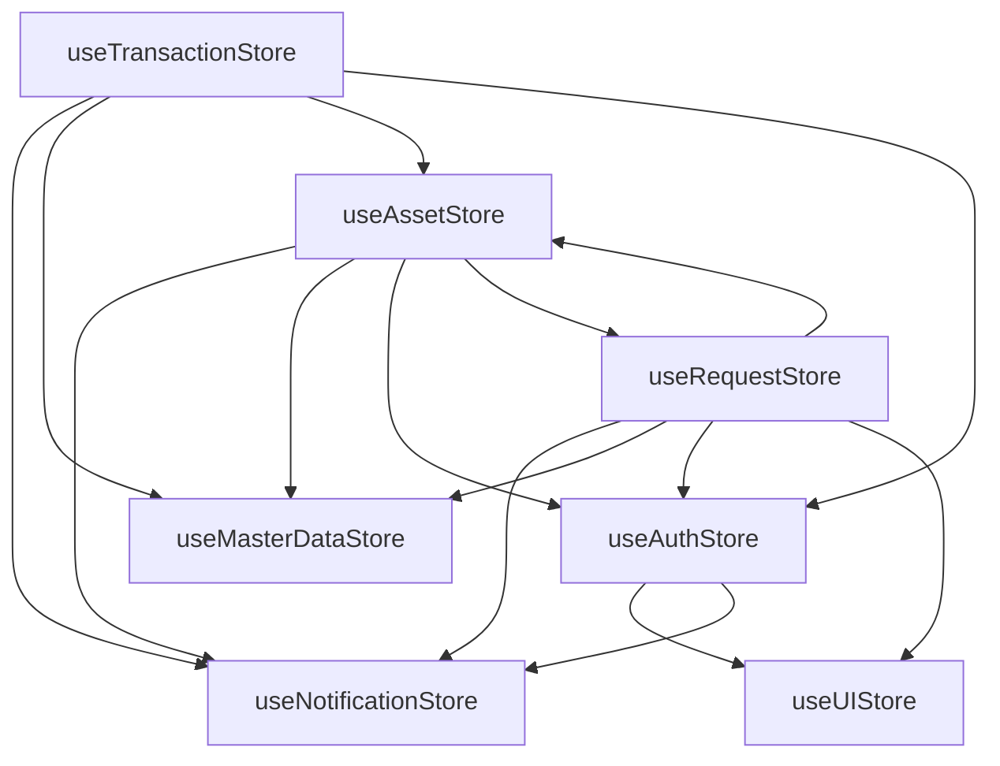

# Panduan State Management (Zustand)

Dokumen ini menjelaskan arsitektur, pola penggunaan, dan best practices untuk state management menggunakan **Zustand** di aplikasi Trinity Asset Flow.

---

## 1. Arsitektur State Management

### 1.1. Mengapa Zustand?

Trinity Asset Flow menggunakan **Zustand** sebagai solusi state management dengan pertimbangan:

| Aspek           | Keunggulan Zustand                                        |
| --------------- | --------------------------------------------------------- |
| **Simplicity**  | API minimal, tidak memerlukan boilerplate seperti Redux   |
| **Performance** | Re-render hanya komponen yang subscribe ke state tertentu |
| **TypeScript**  | Dukungan TypeScript yang sangat baik                      |
| **Middleware**  | Built-in middleware untuk persistence, devtools, dll      |
| **Size**        | Bundle size sangat kecil (~1KB)                           |

### 1.2. Store Architecture

```
┌─────────────────────────────────────────────────────────────────────┐
│                         APPLICATION STATE                           │
├─────────────────────────────────────────────────────────────────────┤
│                                                                     │
│  ┌─────────────┐  ┌─────────────┐  ┌─────────────┐                 │
│  │ useAuthStore│  │ useUIStore  │  │useNotification│               │
│  │             │  │             │  │    Store      │               │
│  │ - currentUser│ │ - activePage│ │ - notifications│               │
│  │ - isLoading │  │ - sidebarOpen│ │ - addToast()  │               │
│  │ - login()   │  │ - waModal   │  │ - markAsRead()│               │
│  └─────────────┘  └─────────────┘  └─────────────┘                 │
│         │                │                │                         │
│         └────────────────┼────────────────┘                         │
│                          │                                          │
│                    CROSS-CUTTING                                    │
│                                                                     │
├─────────────────────────────────────────────────────────────────────┤
│                                                                     │
│  ┌─────────────┐  ┌─────────────┐  ┌─────────────┐                 │
│  │useAssetStore│  │useRequestStore│ │useTransactionStore│          │
│  │             │  │             │  │             │                 │
│  │ - assets    │  │ - requests  │  │ - handovers │                 │
│  │ - categories│  │ - loanReq   │  │ - dismantles│                 │
│  │ - movements │  │ - returns   │  │ - installs  │                 │
│  │ - thresholds│  │             │  │ - mainten.  │                 │
│  └─────────────┘  └─────────────┘  └─────────────┘                 │
│         │                │                │                         │
│         └────────────────┼────────────────┘                         │
│                          │                                          │
│                    DOMAIN STORES                                    │
│                                                                     │
├─────────────────────────────────────────────────────────────────────┤
│                                                                     │
│  ┌─────────────────────────────────────────────────┐               │
│  │              useMasterDataStore                  │               │
│  │                                                  │               │
│  │  - users (untuk assignment/lookup)              │               │
│  │  - divisions (referensi organisasi)             │               │
│  │  - customers (data pelanggan)                   │               │
│  └─────────────────────────────────────────────────┘               │
│                                                                     │
│                    REFERENCE DATA                                   │
│                                                                     │
└─────────────────────────────────────────────────────────────────────┘
```

---

## 2. Store Registry

### 2.1. Daftar Stores

| Store                  | File                             | Responsibility                              | Persistence     |
| ---------------------- | -------------------------------- | ------------------------------------------- | --------------- |
| `useAuthStore`         | `stores/useAuthStore.ts`         | Autentikasi & session user                  | ✅ localStorage |
| `useUIStore`           | `stores/useUIStore.ts`           | State UI global (navigasi, modal, loading)  | ✅ localStorage |
| `useAssetStore`        | `stores/useAssetStore.ts`        | Aset, kategori, pergerakan stok             | ✅ localStorage |
| `useRequestStore`      | `stores/useRequestStore.ts`      | Request procurement & loan                  | ❌              |
| `useTransactionStore`  | `stores/useTransactionStore.ts`  | Handover, dismantle, instalasi, maintenance | ❌              |
| `useMasterDataStore`   | `stores/useMasterDataStore.ts`   | Users, divisions, customers                 | ❌              |
| `useNotificationStore` | `stores/useNotificationStore.ts` | Notifikasi sistem & toast                   | ❌              |

### 2.2. Dependensi Antar Store



---

## 3. Store Patterns

### 3.1. Basic Store Structure

**Template standar untuk membuat store baru:**

```typescript
// stores/useExampleStore.ts

import { create } from "zustand";
import { persist, createJSONStorage } from "zustand/middleware";
import * as api from "../services/api";
import { useNotificationStore } from "./useNotificationStore";

// 1. Define State Interface
interface ExampleState {
  // Data
  items: Item[];
  selectedItem: Item | null;

  // Loading/Error States
  isLoading: boolean;
  error: string | null;

  // Actions
  fetchItems: () => Promise<void>;
  addItem: (item: Omit<Item, "id">) => Promise<void>;
  updateItem: (id: string, data: Partial<Item>) => Promise<void>;
  deleteItem: (id: string) => Promise<void>;
  setSelectedItem: (item: Item | null) => void;
  clearError: () => void;
}

// 2. Create Store
export const useExampleStore = create<ExampleState>()(
  persist(
    (set, get) => ({
      // Initial State
      items: [],
      selectedItem: null,
      isLoading: false,
      error: null,

      // Actions
      fetchItems: async () => {
        set({ isLoading: true, error: null });
        try {
          const data = await api.fetchItems();
          set({ items: data, isLoading: false });
        } catch (err: any) {
          set({ error: err.message, isLoading: false });
        }
      },

      addItem: async (itemData) => {
        const current = get().items;
        const newItem = { ...itemData, id: generateId() };
        const updated = [newItem, ...current];

        await api.updateData("items", updated);
        set({ items: updated });

        useNotificationStore
          .getState()
          .addToast("Item berhasil ditambahkan", "success");
      },

      // ... other actions

      clearError: () => set({ error: null }),
    }),
    {
      name: "example-storage", // localStorage key
      storage: createJSONStorage(() => localStorage),
      partialize: (state) => ({
        items: state.items,
        // Only persist data, not UI state
      }),
    },
  ),
);
```

### 3.2. Persistence Pattern

**Untuk store yang memerlukan persistence:**

```typescript
import { persist, createJSONStorage } from "zustand/middleware";

export const useAuthStore = create<AuthState>()(
  persist(
    (set, get) => ({
      currentUser: null,
      // ... state & actions
    }),
    {
      name: "auth-storage", // Key di localStorage
      storage: createJSONStorage(() => localStorage),

      // Hanya persist field tertentu (PENTING untuk keamanan & performa)
      partialize: (state) => ({
        currentUser: state.currentUser,
      }),

      // Hook saat data di-rehydrate dari storage
      onRehydrateStorage: () => (state) => {
        // Validasi atau transformasi data saat load
        state?.checkSession();
      },
    },
  ),
);
```

**Kapan menggunakan persistence:**

| Use Case                       | Persist?     | Alasan                           |
| ------------------------------ | ------------ | -------------------------------- |
| Auth/Session                   | ✅ Yes       | User tetap login setelah refresh |
| UI Navigation                  | ✅ Yes       | Halaman aktif diingat            |
| Form Draft                     | ⚠️ Opsional  | Menghindari kehilangan data      |
| Domain Data (Assets, Requests) | ⚠️ Mock Only | Di production, fetch dari server |
| Loading/Error States           | ❌ No        | Harus reset tiap session         |

### 3.3. Cross-Store Communication

**Pattern 1: Direct Store Access**

```typescript
// Di dalam action store
addRequest: async (requestData) => {
  // Akses store lain secara langsung
  const { checkAvailability } = useAssetStore.getState();
  const { addToast } = useNotificationStore.getState();
  const { currentUser } = useAuthStore.getState();

  const stockCheck = checkAvailability(item.name, item.brand, item.qty);

  if (!stockCheck.isSufficient) {
    addToast("Stok tidak mencukupi", "warning");
  }

  // ... continue with request creation
};
```

**Pattern 2: Notify Other Stores**

```typescript
// Helper function untuk notifikasi lintas store
const notifyAdmins = (type: string, refId: string, message: string) => {
  const users = useMasterDataStore.getState().users;
  const currentUser = useAuthStore.getState().currentUser;
  const addNotif = useNotificationStore.getState().addSystemNotification;

  if (!currentUser) return;

  users
    .filter((u) => ["Admin Logistik", "Super Admin"].includes(u.role))
    .filter((u) => u.id !== currentUser.id)
    .forEach((admin) => {
      addNotif({
        recipientId: admin.id,
        actorName: currentUser.name,
        type,
        referenceId: refId,
        message,
      });
    });
};
```

---

## 4. Detailed Store Documentation

### 4.1. useAuthStore

**File**: `stores/useAuthStore.ts`

**Purpose**: Mengelola autentikasi, session, dan informasi user yang sedang login.

| State         | Type             | Description                 |
| ------------- | ---------------- | --------------------------- |
| `currentUser` | `User \| null`   | Data user yang login        |
| `isLoading`   | `boolean`        | Status loading operasi auth |
| `error`       | `string \| null` | Pesan error terakhir        |

| Action                        | Parameters       | Description                     |
| ----------------------------- | ---------------- | ------------------------------- |
| `login(email, pass)`          | `string, string` | Login dan sanitize permissions  |
| `logout()`                    | -                | Logout, clear storage, reset UI |
| `requestPasswordReset(email)` | `string`         | Request reset password          |
| `updateCurrentUser(user)`     | `User`           | Update data user saat ini       |
| `checkSession()`              | -                | Validasi integritas session     |

**Security Features:**

- **Permission Sanitization**: Permissions di-enforce berdasarkan role
- **Anti-Tamper Check**: Validasi permissions saat rehydrate dari localStorage
- **Session Cleanup**: Logout membersihkan semua state terkait

```typescript
// Usage Example
const { currentUser, login, logout } = useAuthStore();

// Login
const handleLogin = async () => {
  try {
    const user = await login(email, password);
    navigate("/dashboard");
  } catch (error) {
    // Error sudah di-handle oleh store
  }
};

// Check permission
const canApprove = hasPermission(currentUser, "requests:approve:logistic");
```

---

### 4.2. useUIStore

**File**: `stores/useUIStore.ts`

**Purpose**: Mengelola state UI global seperti navigasi, sidebar, modal, dan loading.

| State               | Type                       | Description                              |
| ------------------- | -------------------------- | ---------------------------------------- |
| `activePage`        | `Page`                     | Halaman yang sedang aktif                |
| `isPageLoading`     | `boolean`                  | Status loading halaman                   |
| `sidebarOpen`       | `boolean`                  | Status sidebar (mobile)                  |
| `pageInitialState`  | `any`                      | Data untuk initialize halaman            |
| `highlightedItemId` | `string \| null`           | ID item untuk highlight setelah navigasi |
| `waModalOpen`       | `boolean`                  | Status WhatsApp simulation modal         |
| `waModalData`       | `WAMessagePayload \| null` | Data untuk WA modal                      |

| Action                               | Parameters         | Description              |
| ------------------------------------ | ------------------ | ------------------------ |
| `setActivePage(page, initialState?)` | `Page, any?`       | Navigate ke halaman      |
| `setPageLoading(isLoading)`          | `boolean`          | Set loading state        |
| `toggleSidebar(isOpen?)`             | `boolean?`         | Toggle/set sidebar       |
| `setHighlightOnReturn(itemId)`       | `string`           | Set item untuk highlight |
| `openWAModal(data)`                  | `WAMessagePayload` | Buka WA simulation modal |
| `resetUIState()`                     | -                  | Reset semua UI state     |

```typescript
// Usage Example
const { setActivePage, activePage, pageInitialState } = useUIStore();

// Navigate with initial state
const goToEditAsset = (asset: Asset) => {
  setActivePage("registration", { mode: "edit", asset });
};

// Read initial state
useEffect(() => {
  if (pageInitialState?.mode === "edit") {
    loadAssetForEdit(pageInitialState.asset);
  }
}, [pageInitialState]);
```

---

### 4.3. useAssetStore

**File**: `stores/useAssetStore.ts`

**Purpose**: Mengelola aset, kategori, threshold stok, dan pergerakan stok.

| State            | Type                     | Description             |
| ---------------- | ------------------------ | ----------------------- |
| `assets`         | `Asset[]`                | Daftar semua aset       |
| `categories`     | `AssetCategory[]`        | Kategori dan tipe aset  |
| `stockMovements` | `StockMovement[]`        | Riwayat pergerakan stok |
| `thresholds`     | `Record<string, number>` | Batas minimum stok      |
| `isLoading`      | `boolean`                | Status loading          |

**Key Actions:**

| Action                                       | Description                            |
| -------------------------------------------- | -------------------------------------- |
| `fetchAssets()`                              | Fetch semua data aset dari API         |
| `addAsset(asset)`                            | Tambah aset baru dengan stock movement |
| `updateAsset(id, data)`                      | Update aset dan catat perubahan        |
| `updateAssetBatch(ids, data, refId?)`        | Update multiple aset sekaligus         |
| `deleteAsset(id)`                            | Hapus aset                             |
| `recordMovement(movement)`                   | Catat pergerakan stok                  |
| `checkAvailability(name, brand, qty, unit?)` | Cek ketersediaan stok (PENTING)        |
| `validateStockForRequest(items)`             | Validasi stok untuk request            |
| `consumeMaterials(materials, context)`       | Konsumsi material (instalasi)          |

**Critical Function: `checkAvailability`**

```typescript
/**
 * Mengecek ketersediaan stok dengan mempertimbangkan:
 * - Physical count (jumlah unit fisik)
 * - Content-based (untuk measurement items seperti kabel)
 * - Reserved stock (sudah dialokasikan untuk request lain)
 * - Fragmentation (stok terpecah di beberapa unit)
 */
checkAvailability: (itemName, brand, qtyNeeded, requestUnit?, excludeRequestId?) => {
    return {
        physicalCount: number,     // Jumlah unit fisik
        totalContent: number,      // Total isi (misal: total meter)
        reservedCount: number,     // Unit yang sudah reserved
        reservedContent: number,   // Isi yang sudah reserved
        availableCount: number,    // Unit tersedia
        availableContent: number,  // Isi tersedia
        availableSmart: number,    // Nilai yang relevan (count/content)
        isSufficient: boolean,     // Apakah cukup?
        isFragmented: boolean,     // Apakah terpecah?
        isMeasurement: boolean,    // Apakah item measurement?
        unitType: 'container' | 'base',
        containerUnit: string,
        baseUnit: string,
        recommendedSourceIds: string[] // ID aset yang direkomendasikan
    };
};
```

---

### 4.4. useRequestStore

**File**: `stores/useRequestStore.ts`

**Purpose**: Mengelola request procurement, loan request, dan pengembalian.

| State          | Type            | Description         |
| -------------- | --------------- | ------------------- |
| `requests`     | `Request[]`     | Request procurement |
| `loanRequests` | `LoanRequest[]` | Request peminjaman  |
| `returns`      | `AssetReturn[]` | Data pengembalian   |
| `isLoading`    | `boolean`       | Status loading      |

**Key Actions:**

| Action                                          | Description                               |
| ----------------------------------------------- | ----------------------------------------- |
| `addRequest(request)`                           | Buat request baru dengan auto stock check |
| `updateRequest(id, data)`                       | Update request (approval, revision)       |
| `deleteRequest(id)`                             | Hapus request                             |
| `addLoanRequest(request)`                       | Buat loan request                         |
| `approveLoanRequest(id, payload)`               | Approve dan assign aset ke loan           |
| `submitReturnRequest(loanId, items)`            | Submit pengembalian aset                  |
| `processReturnBatch(docId, assetIds, approver)` | Proses batch pengembalian                 |

**Smart Request Creation Flow:**

```typescript
addRequest: async (requestData) => {
  // 1. Re-fetch assets untuk data stok terbaru
  await useAssetStore.getState().fetchAssets();

  // 2. Generate document number
  const docNumber = generateDocumentNumber("RO", existingDocs, date);

  // 3. Auto-check stock untuk setiap item
  requestData.items.forEach((item) => {
    const stockCheck = checkAvailability(item.name, item.brand, item.qty);

    if (stockCheck.isSufficient) {
      itemStatuses[item.id] = { status: "stock_allocated" };
    } else {
      itemStatuses[item.id] = { status: "procurement_needed" };
    }
  });

  // 4. Tentukan initial status berdasarkan availability
  const initialStatus = allStockAvailable
    ? ItemStatus.AWAITING_HANDOVER
    : ItemStatus.PENDING;

  // 5. Simpan request
  // ...
};
```

---

### 4.5. useTransactionStore

**File**: `stores/useTransactionStore.ts`

**Purpose**: Mengelola transaksi operasional (handover, dismantle, instalasi, maintenance).

| State           | Type             | Description           |
| --------------- | ---------------- | --------------------- |
| `handovers`     | `Handover[]`     | Serah terima aset     |
| `dismantles`    | `Dismantle[]`    | Penarikan aset        |
| `maintenances`  | `Maintenance[]`  | Laporan maintenance   |
| `installations` | `Installation[]` | Instalasi ke customer |
| `isLoading`     | `boolean`        | Status loading        |

**Key Actions:**

| Action                          | Description                  |
| ------------------------------- | ---------------------------- |
| `addHandover(handover)`         | Catat serah terima aset      |
| `addDismantle(dismantle)`       | Catat penarikan aset         |
| `addInstallation(installation)` | Catat instalasi ke customer  |
| `addMaintenance(maintenance)`   | Catat maintenance            |
| `refreshAll()`                  | Refresh semua data transaksi |

---

### 4.6. useMasterDataStore

**File**: `stores/useMasterDataStore.ts`

**Purpose**: Mengelola data master (users, divisions, customers).

| State       | Type         | Description        |
| ----------- | ------------ | ------------------ |
| `users`     | `User[]`     | Daftar user sistem |
| `divisions` | `Division[]` | Daftar divisi      |
| `customers` | `Customer[]` | Daftar pelanggan   |
| `isLoading` | `boolean`    | Status loading     |

**Key Actions:**

| Action                                      | Description             |
| ------------------------------------------- | ----------------------- |
| `fetchMasterData()`                         | Fetch semua master data |
| `addUser/updateUser/deleteUser`             | CRUD user               |
| `addDivision/updateDivision/deleteDivision` | CRUD divisi             |
| `addCustomer/updateCustomer/deleteCustomer` | CRUD customer           |

---

### 4.7. useNotificationStore

**File**: `stores/useNotificationStore.ts`

**Purpose**: Mengelola notifikasi toast dan sistem.

| State           | Type             | Description      |
| --------------- | ---------------- | ---------------- |
| `notifications` | `Notification[]` | Semua notifikasi |
| `isLoading`     | `boolean`        | Status loading   |

**Key Actions:**

| Action                                | Description                  |
| ------------------------------------- | ---------------------------- |
| `addToast(message, type, options)`    | Tampilkan toast notification |
| `addSystemNotification(notification)` | Tambah notifikasi persistent |
| `removeNotification(id)`              | Hapus notifikasi             |
| `markAsRead(id)`                      | Tandai sudah dibaca          |
| `markAllAsRead(recipientId)`          | Tandai semua sudah dibaca    |

```typescript
// Toast Types
type NotificationType = "success" | "error" | "warning" | "info";

// Usage
const { addToast, addSystemNotification } = useNotificationStore();

// Simple toast
addToast("Berhasil disimpan", "success");

// Toast with action
addToast("Aset berhasil dibuat", "success", {
  duration: 8000,
  actions: [{ label: "Lihat Detail", onClick: () => goToAsset(assetId) }],
});

// System notification (persistent)
addSystemNotification({
  recipientId: targetUserId,
  actorName: currentUser.name,
  type: "request_approved",
  referenceId: requestId,
  message: "Request Anda telah disetujui",
});
```

---

## 5. Best Practices

### 5.1. Selector Pattern

**Hindari re-render dengan selector spesifik:**

```typescript
// ❌ BAD - Subscribe ke seluruh store
const store = useAssetStore();
console.log(store.assets); // Re-render setiap ada perubahan di store

// ✅ GOOD - Subscribe hanya ke field yang dibutuhkan
const assets = useAssetStore((state) => state.assets);
const isLoading = useAssetStore((state) => state.isLoading);

// ✅ BETTER - Multiple selectors dalam satu hook
const { assets, isLoading } = useAssetStore((state) => ({
  assets: state.assets,
  isLoading: state.isLoading,
}));
```

### 5.2. Action Isolation

**Pisahkan side effects dari state update:**

```typescript
// ✅ GOOD - Action fokus pada satu tanggung jawab
addAsset: async (asset) => {
  // 1. Prepare data
  const sanitizedAsset = sanitizeBulkAsset(asset, get().categories);

  // 2. Update state
  const updated = [sanitizedAsset, ...get().assets];
  await api.updateData("app_assets", updated);
  set({ assets: updated });

  // 3. Side effects (terpisah dan jelas)
  await get().recordMovement({
    /* ... */
  });
  notifyAdmins("asset_created", asset.id, "Aset baru ditambahkan");
};
```

### 5.3. Error Handling di Store

```typescript
// ✅ GOOD - Pattern error handling yang konsisten
fetchAssets: async () => {
    set({ isLoading: true, error: null });
    try {
        const data = await api.fetchAssets();
        set({ assets: data, isLoading: false });
    } catch (err: any) {
        set({
            error: err.message || 'Gagal memuat data',
            isLoading: false
        });
        // Jangan throw jika error sudah di-handle
    }
},
```

### 5.4. Data Integrity Helpers

**Gunakan helper functions untuk menjaga integritas data:**

```typescript
// Helper untuk memastikan nilai integer
const toInt = (num: number | undefined | null): number => {
  if (num === undefined || num === null || isNaN(num)) return 0;
  return Math.round(num);
};

// Helper untuk sanitize bulk asset
const sanitizeBulkAsset = (
  asset: Asset,
  categories: AssetCategory[],
): Asset => {
  const category = categories.find((c) => c.name === asset.category);
  const type = category?.types.find((t) => t.name === asset.type);

  // Bulk items tidak boleh punya SN/MAC
  if (type?.trackingMethod === "bulk") {
    return { ...asset, serialNumber: undefined, macAddress: undefined };
  }
  return asset;
};
```

### 5.5. Testing Stores

```typescript
// __tests__/stores/useAssetStore.test.ts
import { renderHook, act } from "@testing-library/react";
import { useAssetStore } from "../stores/useAssetStore";

describe("useAssetStore", () => {
  beforeEach(() => {
    // Reset store sebelum tiap test
    useAssetStore.setState({ assets: [], isLoading: false });
  });

  test("should add asset correctly", async () => {
    const { result } = renderHook(() => useAssetStore());

    await act(async () => {
      await result.current.addAsset(mockAsset);
    });

    expect(result.current.assets).toHaveLength(1);
    expect(result.current.assets[0].name).toBe(mockAsset.name);
  });

  test("should check availability correctly", () => {
    // Setup initial state
    useAssetStore.setState({ assets: mockAssetsInStorage });

    const { result } = renderHook(() => useAssetStore());
    const availability = result.current.checkAvailability(
      "Kabel UTP",
      "Belden",
      100,
    );

    expect(availability.isSufficient).toBe(true);
    expect(availability.availableCount).toBeGreaterThan(0);
  });
});
```

---

## 6. Debugging & DevTools

### 6.1. Zustand DevTools

```typescript
import { devtools } from "zustand/middleware";

export const useAssetStore = create<AssetState>()(
  devtools(
    persist(
      (set, get) => ({
        // ... store implementation
      }),
      { name: "asset-storage" },
    ),
    { name: "AssetStore" }, // Nama di DevTools
  ),
);
```

### 6.2. Logging State Changes

```typescript
// Middleware untuk logging (development only)
const logMiddleware = (config) => (set, get, api) =>
  config(
    (args) => {
      console.log("  Prev State:", get());
      set(args);
      console.log("  Next State:", get());
    },
    get,
    api,
  );
```

---

## 7. Migration Guide

### 7.1. Adding New Field to Store

```typescript
// 1. Update interface
interface AssetState {
  assets: Asset[];
  newField: string; // ← Tambahkan field baru
}

// 2. Tambahkan initial value
export const useAssetStore = create<AssetState>()((set) => ({
  assets: [],
  newField: "", // ← Initial value
}));

// 3. Jika persisted, handle migration
persist(
  (set) => ({
    /* ... */
  }),
  {
    name: "asset-storage",
    version: 2, // ← Increment version
    migrate: (persistedState, version) => {
      if (version === 1) {
        // Migration dari v1 ke v2
        return {
          ...persistedState,
          newField: "default", // ← Default value untuk existing data
        };
      }
      return persistedState;
    },
  },
);
```

---

## 8. Checklist Review Store

- [ ] State interface terdefinisi dengan jelas
- [ ] Semua actions mengembalikan Promise untuk async operations
- [ ] Error handling konsisten (isLoading, error state)
- [ ] Side effects dipisahkan dari state updates
- [ ] Persistence hanya untuk data yang diperlukan
- [ ] Selector digunakan untuk optimasi re-render
- [ ] Tidak ada circular dependency antar stores
- [ ] Helper functions untuk data integrity
- [ ] Unit tests untuk critical actions
