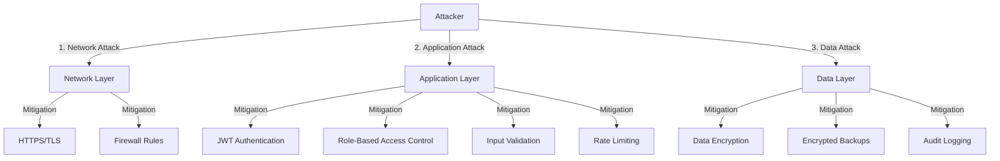

# Panduan Keamanan Aplikasi

Keamanan adalah aspek non-fungsional terpenting dalam aplikasi produksi. Dokumen ini merangkum standar dan implementasi keamanan teknis yang **wajib** diterapkan pada Aplikasi Inventori Aset.

## 1. Keamanan Jaringan & Transport

### 1.1. Wajib HTTPS (TLS/SSL)

Semua komunikasi data antara klien (browser) dan server **wajib** dienkripsi.

- **Implementasi**: Nginx menangani terminasi SSL.
- **Force Redirect**: HTTP (port 80) harus selalu di-redirect ke HTTPS (port 443).
- **HSTS**: Aktifkan HTTP Strict Transport Security header di Nginx.

### 1.2. HTTP Security Headers (Helmet)

Backend menggunakan pustaka `helmet` untuk mengatur header HTTP standar guna mencegah serangan umum seperti XSS, Clickjacking, dan Sniffing.

**Implementasi (`main.ts`):**

```typescript
import helmet from "helmet";
app.use(helmet());
```

## 2. Proteksi API (Backend)

### 2.1. Rate Limiting (Anti Brute-Force & DDoS)

Mencegah penyalahgunaan API dengan membatasi jumlah request dari satu IP dalam periode waktu tertentu.

**Implementasi (`app.module.ts`):**
Menggunakan `@nestjs/throttler`.

```typescript
ThrottlerModule.forRoot([
  {
    ttl: 60000, // 1 menit
    limit: 100, // Maksimal 100 request per menit per IP
  },
]);
```

### 2.2. Cross-Origin Resource Sharing (CORS) Ketat

Di produksi, jangan pernah menggunakan `origin: *`. Hanya izinkan domain frontend yang sah.

**Implementasi (`main.ts`):**

```typescript
app.enableCors({
  origin: ["https://aset.trinitimedia.com"], // Domain Produksi
  methods: "GET,HEAD,PUT,PATCH,POST,DELETE",
  credentials: true,
});
```

### 2.3. Validasi Input (Sanitasi Data)

Jangan pernah mempercayai input dari pengguna. Semua payload request harus divalidasi menggunakan DTO dan `class-validator`.

**Implementasi Global:**

```typescript
app.useGlobalPipes(
  new ValidationPipe({
    whitelist: true, // Membuang properti JSON yang tidak ada di DTO (mencegah pollution)
    forbidNonWhitelisted: true, // Throw error jika ada properti ilegal
    transform: true,
  })
);
```

## 3. Autentikasi & Otorisasi

### 3.1. Mekanisme JWT (JSON Web Token)

- **Stateless**: Server tidak menyimpan session state.
- **Short-Lived Access Token**: Token akses hanya berlaku singkat (misal 12 jam).
- **Penyimpanan Klien**: Disarankan menggunakan `httpOnly` cookie untuk mencegah pencurian token via XSS (Cross-Site Scripting), atau `localStorage` dengan sanitasi XSS yang ketat.
- **Refresh Token Pattern** (Rekomendasi Lanjutan): Gunakan refresh token berumur panjang (7 hari) yang disimpan di database dan `httpOnly` cookie untuk memperbarui access token tanpa login ulang.

### 3.2. RBAC & Policy (Matriks Akses)

Gunakan decorator `@Roles()` di setiap endpoint kritis. Berikut adalah matriks sederhana:

| Endpoint Group                    |  Staff   |  Leader  | Admin Logistik | Admin Purchase | Super Admin |
| :-------------------------------- | :------: | :------: | :------------: | :------------: | :---------: |
| `GET /api/assets`                 | ✅ (Own) | ✅ (Own) |    ✅ (All)    |    ✅ (All)    |  ✅ (All)   |
| `POST /api/assets`                |    ❌    |    ❌    |       ✅       |       ❌       |     ✅      |
| `DELETE /api/assets`              |    ❌    |    ❌    |       ❌       |       ❌       |     ✅      |
| `POST /api/requests`              |    ✅    |    ✅    |       ✅       |       ✅       |     ✅      |
| `PATCH /api/requests/:id/approve` |    ❌    |    ❌    |  ✅ (Level 1)  |  ✅ (Level 2)  | ✅ (Final)  |

**Least Privilege Principle**: Berikan hak akses seminimal mungkin.

## 4. Keamanan Data & Integritas

### 4.1. Audit Trail (Append-Only Log)

Untuk memenuhi standar kepatuhan audit hukum, tabel `ActivityLog` harus diperlakukan sebagai catatan sejarah yang sakral.

- **Immutability**: Backend **TIDAK BOLEH** mengekspos endpoint untuk `UPDATE` atau `DELETE` pada tabel `ActivityLog`. Log hanya boleh di-_insert_.
- **Kelengkapan**: Setiap aksi "Mutasi" (Create, Update, Delete) pada entitas bisnis (Asset, Request) wajib memicu pembuatan record baru di `ActivityLog` dalam satu transaksi database (`prisma.$transaction`).
- **Traceability**: Log harus mencatat `WHO` (User ID), `WHAT` (Action), `WHEN` (Timestamp), dan `DETAILS` (Snapshot data atau diff).

### 4.2. Database Security

- **SQL Injection**: Penggunaan **Prisma ORM** secara otomatis memitigasi risiko SQL Injection karena penggunaan _parameterized queries_ di level engine. Hindari penggunaan `$queryRaw` dengan string concatenation manual.
- **Database User Isolation**: User database yang digunakan aplikasi (`triniti_admin`) sebaiknya hanya memiliki hak akses `CRUD` pada tabel aplikasi, bukan `SUPERUSER`.
- **Backup Encryption**: File backup `.sql.gz` harus dienkripsi (misal menggunakan GPG) sebelum ditransfer keluar server (ke Cloud Storage) untuk mencegah kebocoran data jika backup dicuri.
- **Connection Pooling**: Gunakan connection pooling untuk mencegah connection exhaustion attacks.
- **Database Firewall**: Hanya izinkan koneksi database dari IP aplikasi backend, bukan dari internet publik.

---

## 5. Threat Model & Security Analysis

### 5.1. Threat Model Diagram



### 5.2. Identified Threats & Mitigations

| Threat ID | Threat Description | Impact | Likelihood | Mitigation | Status |
|-----------|-------------------|--------|------------|------------|--------|
| **T-001** | SQL Injection | High | Low | Prisma ORM (parameterized queries) | ✅ Mitigated |
| **T-002** | XSS (Cross-Site Scripting) | High | Medium | Input sanitization, CSP headers | ✅ Mitigated |
| **T-003** | CSRF (Cross-Site Request Forgery) | Medium | Medium | CSRF tokens, SameSite cookies | ⚠️ To Implement |
| **T-004** | Brute Force Login | Medium | Medium | Rate limiting, account lockout | ✅ Mitigated |
| **T-005** | JWT Token Theft | High | Low | HttpOnly cookies, short token expiry | ✅ Mitigated |
| **T-006** | Privilege Escalation | High | Low | RBAC, proper authorization checks | ✅ Mitigated |
| **T-007** | Data Leakage | High | Medium | Encryption at rest, access controls | ✅ Mitigated |
| **T-008** | DDoS Attack | Medium | Low | Rate limiting, CDN, load balancing | ✅ Mitigated |
| **T-009** | Man-in-the-Middle | High | Low | HTTPS/TLS, certificate pinning | ✅ Mitigated |
| **T-010** | Race Condition (Asset Assignment) | High | Medium | Database transactions, locking | ✅ Mitigated |

### 5.3. Security Controls Matrix

| Control Category | Control | Implementation | Verification |
|-----------------|---------|----------------|-------------|
| **Authentication** | JWT with short expiry | ✅ Implemented | Token expiry < 12h |
| **Authentication** | Password hashing (bcrypt) | ✅ Implemented | Salt rounds >= 10 |
| **Authorization** | RBAC per endpoint | ✅ Implemented | All endpoints protected |
| **Input Validation** | DTO validation | ✅ Implemented | All endpoints validated |
| **Output Encoding** | XSS prevention | ✅ Implemented | All user input encoded |
| **Encryption** | HTTPS/TLS | ✅ Implemented | TLS 1.2+ enforced |
| **Logging** | Audit trail | ✅ Implemented | All mutations logged |
| **Monitoring** | Security events | ⚠️ To Implement | Failed login, suspicious activity |
| **Backup** | Encrypted backups | ✅ Implemented | GPG encryption |

---

## 6. Security Audit Checklist

### 6.1. Pre-Deployment Security Checklist

#### Authentication & Authorization
- [ ] JWT secret menggunakan string acak panjang (min 64 karakter)
- [ ] Token expiry time tidak lebih dari 12 jam
- [ ] Refresh token mechanism diimplementasikan (jika ada)
- [ ] Password hashing menggunakan bcrypt dengan salt rounds >= 10
- [ ] Semua endpoint yang memerlukan auth memiliki guard
- [ ] RBAC diimplementasikan dengan decorator `@Roles()`
- [ ] User tidak bisa mengubah role sendiri
- [ ] Super Admin actions memerlukan konfirmasi tambahan

#### Input Validation & Sanitization
- [ ] Semua DTO menggunakan `class-validator` decorators
- [ ] `ValidationPipe` dengan `whitelist: true` dan `forbidNonWhitelisted: true`
- [ ] File uploads divalidasi (type, size)
- [ ] SQL injection prevention (Prisma ORM, no raw queries)
- [ ] XSS prevention (input sanitization, output encoding)
- [ ] CSRF protection (tokens atau SameSite cookies)

#### Network & Transport Security
- [ ] HTTPS enforced (HTTP redirect to HTTPS)
- [ ] TLS 1.2+ only
- [ ] HSTS header enabled
- [ ] Security headers (Helmet.js) configured
- [ ] CORS configured dengan whitelist domain (bukan `*`)
- [ ] Database port tidak exposed ke internet

#### Data Protection
- [ ] Sensitive data encrypted at rest
- [ ] Passwords never logged
- [ ] API keys stored in environment variables (not in code)
- [ ] Database backups encrypted
- [ ] PII (Personally Identifiable Information) handled according to policy

#### Application Security
- [ ] Rate limiting enabled
- [ ] Error messages tidak expose sensitive information
- [ ] Logging tidak mengandung sensitive data
- [ ] Dependencies up-to-date (no known vulnerabilities)
- [ ] Security headers configured (X-Frame-Options, X-Content-Type-Options, etc.)

### 6.2. Runtime Security Checklist

#### Monitoring
- [ ] Failed login attempts monitored
- [ ] Unusual activity patterns detected
- [ ] API rate limit violations logged
- [ ] Security events sent to monitoring system
- [ ] Regular security log review scheduled

#### Incident Response
- [ ] Incident response plan documented
- [ ] Security team contact information available
- [ ] Backup and recovery procedures tested
- [ ] Security breach notification process defined

### 6.3. Regular Security Tasks

#### Weekly
- [ ] Review security logs
- [ ] Check for failed login attempts
- [ ] Review user access permissions
- [ ] Check for unusual API usage patterns

#### Monthly
- [ ] Dependency security audit (npm audit, Snyk)
- [ ] Review and rotate API keys
- [ ] Review user accounts (deactivate unused)
- [ ] Security patch updates

#### Quarterly
- [ ] Full security audit
- [ ] Penetration testing
- [ ] Review and update security policies
- [ ] Security training for team

---

## 7. Security Best Practices

### 7.1. Password Policy

- **Minimum Length**: 8 karakter
- **Complexity**: Harus mengandung huruf besar, huruf kecil, angka, dan karakter khusus
- **Expiry**: (Opsional) Rotate setiap 90 hari
- **History**: Tidak boleh sama dengan 5 password terakhir
- **Storage**: Hash dengan bcrypt, salt rounds >= 10

### 7.2. Session Management

- **Token Expiry**: Access token 12 jam, refresh token 7 hari
- **Token Storage**: HttpOnly cookies (preferred) atau localStorage dengan XSS protection
- **Logout**: Invalidate token di server (blacklist)
- **Concurrent Sessions**: (Opsional) Limit jumlah session aktif per user

### 7.3. Error Handling

**DO:**
```typescript
// Generic error message untuk user
throw new BadRequestException('Invalid request');

// Detailed error untuk logging (server-side only)
logger.error('Detailed error info', { error, userId, requestId });
```

**DON'T:**
```typescript
// Jangan expose internal error details
throw new Error(`Database connection failed: ${dbError.message}`);
```

### 7.4. Logging Security Events

Log semua security-relevant events:
- Failed login attempts
- Successful logins from new IP/location
- Permission denied attempts
- Password change requests
- Role changes
- Sensitive data access
- Bulk operations

---

## 8. Compliance & Regulations

### 8.1. Data Privacy

- **PII Handling**: Personal data harus di-handle sesuai dengan kebijakan privasi
- **Data Retention**: Tentukan policy retensi data
- **Right to Deletion**: Implementasi soft delete untuk data user
- **Data Export**: User harus bisa export data mereka sendiri

### 8.2. Audit Requirements

- **Audit Trail**: Semua perubahan data harus tercatat
- **Immutable Logs**: ActivityLog tidak bisa dihapus atau diubah
- **Log Retention**: Simpan logs minimal 1 tahun
- **Access Logs**: Log semua akses ke data sensitif

---

## 9. Security Incident Response

### 9.1. Incident Classification

| Severity | Description | Response Time |
|----------|-------------|---------------|
| **Critical** | Data breach, system compromise | Immediate (< 1 hour) |
| **High** | Unauthorized access, privilege escalation | < 4 hours |
| **Medium** | Failed attack attempts, suspicious activity | < 24 hours |
| **Low** | Security misconfigurations | < 1 week |

### 9.2. Response Procedure

1. **Detect**: Identify security incident
2. **Contain**: Isolate affected systems
3. **Eradicate**: Remove threat
4. **Recover**: Restore systems
5. **Document**: Record incident and lessons learned

---

## 10. Security Testing

### 10.1. Automated Security Testing

- **Dependency Scanning**: `npm audit`, Snyk
- **SAST (Static Analysis)**: ESLint security plugins
- **DAST (Dynamic Analysis)**: OWASP ZAP, Burp Suite
- **Container Scanning**: Docker image vulnerabilities

### 10.2. Manual Security Testing

- **Penetration Testing**: Quarterly by external team
- **Code Review**: Security-focused code review
- **Threat Modeling**: Regular threat model updates

---

## 11. References

- [OWASP Top 10](https://owasp.org/www-project-top-ten/)
- [NIST Cybersecurity Framework](https://www.nist.gov/cyberframework)
- [OWASP API Security Top 10](https://owasp.org/www-project-api-security/)
- [CWE Top 25](https://cwe.mitre.org/top25/)

---

**Last Updated**: 2025-01-XX
**Next Review**: 2025-04-XX
