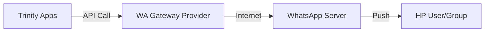

# Integrasi Pihak Ketiga: WhatsApp Gateway

Dokumen ini menjelaskan prosedur teknis untuk menghubungkan sistem dengan layanan WhatsApp Gateway untuk notifikasi otomatis.

## 1. Arsitektur

Karena WhatsApp memerlukan koneksi fisik ke perangkat seluler (nomor HP), sistem ini menggunakan pendekatan **Provider Adapter**. AI Studio menyediakan kode integrasi, namun koneksi fisik harus dilakukan manual.



## 2. Prasyarat

1.  **Nomor WhatsApp Khusus**: Siapkan satu nomor HP/WhatsApp Bisnis khusus untuk dijadikan "Bot Pengirim" (Sender). Jangan gunakan nomor pribadi.
2.  **Akun Provider**: Kami merekomendasikan provider seperti Fonnte, Watzap.id, atau Twilio. (Contoh di bawah menggunakan provider generik berbasis QR Code).

## 3. Prosedur Pairing (QR Code)

Proses ini hanya perlu dilakukan satu kali atau jika sesi terputus.

1.  **Akses Panel Provider**:
    Masuk ke dashboard provider WhatsApp Gateway yang Anda pilih (misal: dashboard.watzap.id).
2.  **Generate QR**:
    Pilih menu "Device" atau "Scan QR". Sebuah QR Code akan muncul di layar.
3.  **Scan via HP**:
    *   Buka WhatsApp di HP "Bot Pengirim".
    *   Buka Menu (titik tiga) > **Linked Devices** (Perangkat Tertaut).
    *   Klik **Link a Device** dan scan QR Code di dashboard provider.
4.  **Verifikasi**:
    Pastikan status di dashboard berubah menjadi "Connected".

## 4. Konfigurasi di Aplikasi (Environment Variables)

Setelah terhubung, Anda akan mendapatkan `API_KEY` atau `TOKEN`. Masukkan kredensial ini ke file `.env` di server backend:

```env
# Konfigurasi WA Gateway
WA_API_URL=https://api.provider-pilihan.com/send
WA_API_KEY=ganti_dengan_api_key_dari_dashboard

# Target Group ID (Didapat dari info group WA)
# Cara cek ID: Masukkan bot ke grup, lalu panggil endpoint /groups di provider
WA_GROUP_LOGISTIC_ID=1203630xxxxxx@g.us
WA_GROUP_PURCHASE_ID=1203630xxxxxx@g.us
```

## 5. Troubleshooting Notifikasi

*   **Pesan Tidak Masuk**:
    *   Cek apakah HP Bot memiliki koneksi internet.
    *   Cek apakah sesi WhatsApp Web di HP Bot terputus (Logout). Jika ya, lakukan scan ulang.
*   **Format Pesan Berantakan**:
    *   Pastikan fungsi `sanitize` di kode backend (`src/services/whatsappIntegration.ts`) berjalan untuk menghindari karakter yang merusak format markdown WhatsApp.
