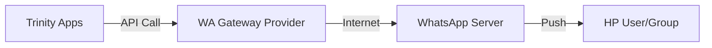

# Integrasi Pihak Ketiga: WhatsApp Gateway

Dokumen ini menjelaskan prosedur teknis untuk menghubungkan sistem dengan layanan WhatsApp Gateway untuk notifikasi otomatis.

## 1. Arsitektur

Karena WhatsApp memerlukan koneksi fisik ke perangkat seluler (nomor HP), sistem ini menggunakan pendekatan **Provider Adapter**. AI Studio menyediakan kode integrasi, namun koneksi fisik harus dilakukan manual.


```mermaid
graph LR
    System[Trinity Apps] -->|API Call| WAGateway[WA Gateway Provider]
    WAGateway -->|Internet| WhatsApp[WhatsApp Server]
    WhatsApp -->|Push| UserDevice[HP User/Group]
```

## 2. Prasyarat

1.  **Nomor WhatsApp Khusus**: Siapkan satu nomor HP/WhatsApp Bisnis khusus untuk dijadikan "Bot Pengirim" (Sender). Jangan gunakan nomor pribadi.
2.  **Akun Provider**: Kami merekomendasikan provider seperti Fonnte, Watzap.id, atau Twilio. (Contoh di bawah menggunakan provider generik berbasis QR Code).

## 3. Prosedur Pairing (QR Code)

Proses ini hanya perlu dilakukan satu kali atau jika sesi terputus.

1.  **Akses Panel Provider**:
    Masuk ke dashboard provider WhatsApp Gateway yang Anda pilih (misal: dashboard.watzap.id).
2.  **Generate QR**:
    Pilih menu "Device" atau "Scan QR". Sebuah QR Code akan muncul di layar.
3.  **Scan via HP**:
    - Buka WhatsApp di HP "Bot Pengirim".
    - Buka Menu (titik tiga) > **Linked Devices** (Perangkat Tertaut).
    - Klik **Link a Device** dan scan QR Code di dashboard provider.
4.  **Verifikasi**:
    Pastikan status di dashboard berubah menjadi "Connected".

## 4. Konfigurasi di Aplikasi (Environment Variables)

Setelah terhubung, Anda akan mendapatkan `API_KEY` atau `TOKEN`. Masukkan kredensial ini ke file `.env` di server backend:

```env
# Konfigurasi WA Gateway
WA_API_URL=https://api.provider-pilihan.com/send
WA_API_KEY=ganti_dengan_api_key_dari_dashboard

# Target Group ID (Didapat dari info group WA)
# Cara cek ID: Masukkan bot ke grup, lalu panggil endpoint /groups di provider
WA_GROUP_LOGISTIC_ID=1203630xxxxxx@g.us
WA_GROUP_PURCHASE_ID=1203630xxxxxx@g.us
```

## 5. Troubleshooting Notifikasi

- **Pesan Tidak Masuk**:
  - Cek apakah HP Bot memiliki koneksi internet.
  - Cek apakah sesi WhatsApp Web di HP Bot terputus (Logout). Jika ya, lakukan scan ulang.
- **Format Pesan Berantakan**:
  - Pastikan fungsi `sanitize` di kode backend (`src/services/whatsappIntegration.ts`) berjalan untuk menghindari karakter yang merusak format markdown WhatsApp.

---

## 6. Implementasi Backend (NestJS)

### 6.1. Service Structure

```typescript
// backend/src/notifications/whatsapp.service.ts
import { Injectable } from '@nestjs/common';
import { ConfigService } from '@nestjs/config';
import axios from 'axios';

@Injectable()
export class WhatsAppService {
  private readonly apiUrl: string;
  private readonly apiKey: string;
  private readonly groups: {
    logistic: string;
    purchase: string;
    management: string;
  };

  constructor(private configService: ConfigService) {
    this.apiUrl = this.configService.get<string>('WA_API_URL');
    this.apiKey = this.configService.get<string>('WA_API_KEY');
    this.groups = {
      logistic: this.configService.get<string>('WA_GROUP_LOGISTIC_ID'),
      purchase: this.configService.get<string>('WA_GROUP_PURCHASE_ID'),
      management: this.configService.get<string>('WA_GROUP_MANAGEMENT_ID'),
    };
  }

  async sendMessage(group: 'logistic' | 'purchase' | 'management', message: string): Promise<void> {
    const groupId = this.groups[group];
    
    // Sanitize message untuk WhatsApp
    const sanitizedMessage = this.sanitizeMessage(message);
    
    try {
      await axios.post(
        `${this.apiUrl}/send`,
        {
          target: groupId,
          message: sanitizedMessage,
        },
        {
          headers: {
            'Authorization': `Bearer ${this.apiKey}`,
            'Content-Type': 'application/json',
          },
        }
      );
    } catch (error) {
      // Log error but don't throw (non-critical)
      console.error('WhatsApp notification failed:', error);
    }
  }

  private sanitizeMessage(message: string): string {
    // Remove WhatsApp formatting characters that might break message
    return message
      .replace(/\*/g, '')
      .replace(/_/g, '')
      .replace(/~/g, '')
      .replace(/\n{3,}/g, '\n\n') // Max 2 consecutive newlines
      .trim();
  }
}
```

### 6.2. Integration Points

**Trigger Notifikasi di Service:**

```typescript
// backend/src/requests/requests.service.ts
import { WhatsAppService } from '../notifications/whatsapp.service';

@Injectable()
export class RequestsService {
  constructor(
    private prisma: PrismaService,
    private whatsappService: WhatsAppService,
  ) {}

  async create(createRequestDto: CreateRequestDto, userId: number) {
    const request = await this.prisma.request.create({...});
    
    // Trigger notifikasi ke Admin Logistik
    await this.whatsappService.sendMessage(
      'logistic',
      `📦 Request Baru: ${request.id}\n` +
      `Requester: ${request.requester.name}\n` +
      `Items: ${request.items.length} item\n` +
      `Status: PENDING`
    );
    
    return request;
  }

  async approve(id: string, approverId: number) {
    const request = await this.prisma.request.update({...});
    
    // Notifikasi ke Purchase jika perlu
    if (request.status === 'LOGISTIC_APPROVED') {
      await this.whatsappService.sendMessage(
        'purchase',
        `✅ Request ${request.id} disetujui Logistik\n` +
        `Siap untuk proses pengadaan`
      );
    }
    
    return request;
  }
}
```

---

## 7. Format Pesan Notifikasi

### 7.1. Template Pesan

**Request Baru:**
```
📦 *Request Baru*
ID: REQ-2025-001
Requester: John Doe (Network Engineering)
Items: 3 item
Status: PENDING
Tanggal: 20 Jan 2025

Mohon segera ditinjau.
```

**Request Disetujui:**
```
✅ *Request Disetujui*
ID: REQ-2025-001
Disetujui oleh: Admin Logistik
Status: LOGISTIC_APPROVED

Siap untuk proses pengadaan.
```

**Aset Rusak:**
```
⚠️ *Laporan Kerusakan Aset*
Asset ID: AST-2025-001
Nama: Router MikroTik RB750
Dilaporkan oleh: John Doe
Deskripsi: Router tidak bisa boot

Mohon segera ditindaklanjuti.
```

### 7.2. Customization

Template pesan dapat dikustomisasi di `WhatsAppService` sesuai kebutuhan.

---

## 8. Error Handling & Retry Logic

```typescript
async sendMessageWithRetry(
  group: string,
  message: string,
  maxRetries: number = 3
): Promise<void> {
  for (let attempt = 1; attempt <= maxRetries; attempt++) {
    try {
      await this.sendMessage(group, message);
      return; // Success
    } catch (error) {
      if (attempt === maxRetries) {
        // Log to database or monitoring system
        this.logger.error('WhatsApp notification failed after retries', {
          group,
          attempts: maxRetries,
          error: error.message,
        });
        throw error;
      }
      // Exponential backoff
      await this.sleep(1000 * Math.pow(2, attempt));
    }
  }
}
```

---

## 9. Monitoring & Analytics

### 9.1. Metrics to Track

- Total notifications sent
- Success rate
- Failure rate by group
- Average delivery time
- Error types and frequency

### 9.2. Logging

Log semua aktivitas WhatsApp:
- Message sent (with group, timestamp)
- Message failed (with error details)
- Retry attempts
- Provider API responses

---

## 10. Alternative Providers

Jika provider utama tidak tersedia, sistem harus mendukung multiple providers:

### 10.1. Provider Abstraction

```typescript
interface WhatsAppProvider {
  sendMessage(groupId: string, message: string): Promise<void>;
}

class WatzapProvider implements WhatsAppProvider { ... }
class FonnteProvider implements WhatsAppProvider { ... }
class TwilioProvider implements WhatsAppProvider { ... }
```

### 10.2. Provider Selection

Gunakan environment variable untuk memilih provider:
```env
WA_PROVIDER=watzap  # watzap, fonnte, twilio
```

---

## 11. Testing Integration

### 11.1. Unit Tests

```typescript
describe('WhatsAppService', () => {
  it('should sanitize message correctly', () => {
    const service = new WhatsAppService(mockConfig);
    const result = service.sanitizeMessage('Test *bold* _italic_');
    expect(result).toBe('Test bold italic');
  });
});
```

### 11.2. Integration Tests

```typescript
describe('WhatsApp Integration', () => {
  it('should send notification on request creation', async () => {
    const whatsappSpy = jest.spyOn(whatsappService, 'sendMessage');
    
    await requestsService.create(createRequestDto, userId);
    
    expect(whatsappSpy).toHaveBeenCalledWith(
      'logistic',
      expect.stringContaining('Request Baru')
    );
  });
});
```

---

## 12. Future Enhancements

- [ ] Support untuk WhatsApp Business API (official)
- [ ] Template messages untuk berbagai event
- [ ] Rich media support (images, documents)
- [ ] Two-way communication (reply dari WhatsApp)
- [ ] Message scheduling
- [ ] Analytics dashboard untuk notifikasi

---

**Last Updated**: 2025-01-XX
