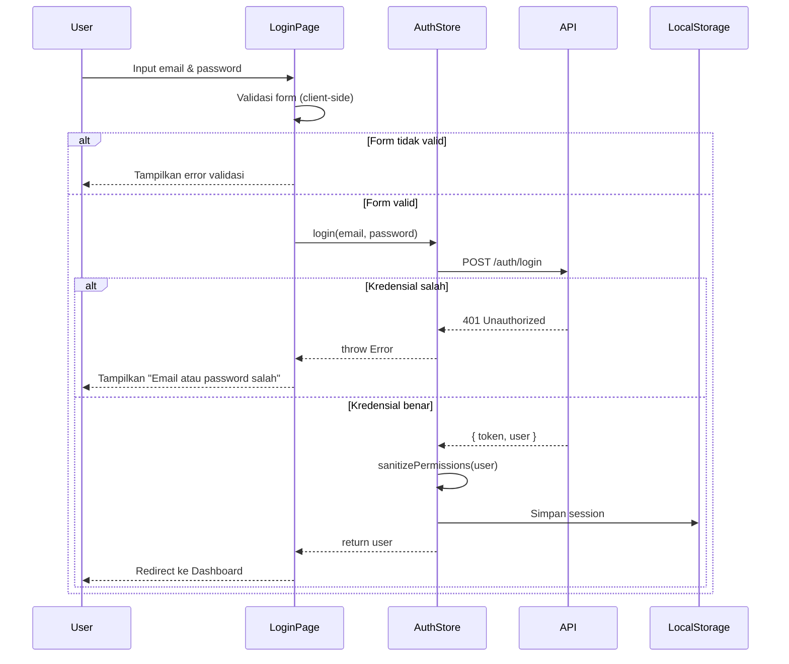
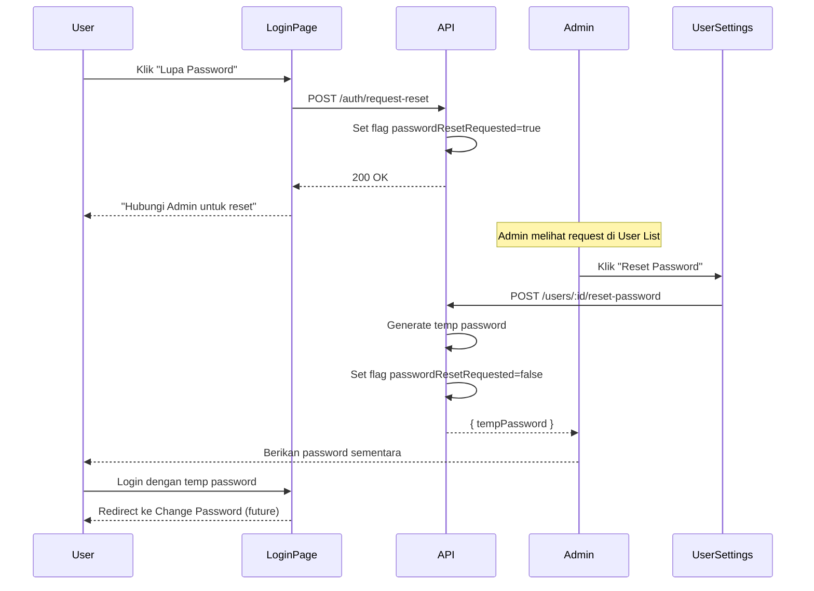

# Logika Bisnis: Autentikasi & Otorisasi

## 1. Alur Login



## 2. State Machine: Session

```
┌─────────────┐     login()      ┌──────────────┐
│  LOGGED_OUT │ ─────────────────►│  LOGGED_IN   │
└─────────────┘                   └──────────────┘
       ▲                                 │
       │                                 │
       │         logout()                │
       │         token expired           │
       │         401 response            │
       └─────────────────────────────────┘
```

## 3. Alur Permission Check

```typescript
// Pseudocode
function canAccess(user: User, requiredPermission: Permission): boolean {
  // 1. Cek apakah user memiliki permission secara langsung
  if (user.permissions.includes(requiredPermission)) {
    return true;
  }

  // 2. Cek wildcard permission (Super Admin biasanya punya '*')
  if (user.permissions.includes("*")) {
    return true;
  }

  // 3. Default: Tolak akses
  return false;
}
```

### Implementasi di React

```tsx
// Penggunaan di komponen
import { hasPermission } from "../../utils/permissions";

const MyComponent = ({ currentUser }) => {
  const canEdit = hasPermission(currentUser, "assets:edit");
  const canDelete = hasPermission(currentUser, "assets:delete");

  return (
    <div>
      {canEdit && <Button>Edit</Button>}
      {canDelete && <Button variant="danger">Hapus</Button>}
    </div>
  );
};
```

## 4. Alur Password Reset



## 5. Business Rules

### BR-AUTH-001: Validasi Email

```
WHEN user attempts login
IF email format is invalid
THEN reject with "Format email tidak valid"
```

### BR-AUTH-002: Attempt Limiting (Backend Target)

```
WHEN user fails login 5 times
THEN lock account for 15 minutes
AND notify admin
```

### BR-AUTH-003: Password Requirements (Backend Target)

```
Password MUST:
- Minimum 8 characters
- At least 1 uppercase letter
- At least 1 number
- At least 1 special character
```

### BR-AUTH-004: Session Timeout

```
IF user is inactive for 8 hours
THEN automatically logout
AND redirect to login page
```

### BR-AUTH-005: Permission Inheritance

```
Role permissions are BASE permissions.
Custom permissions can be ADDED (never removed from base).
Super Admin always has ALL permissions.
```

## 6. Error Handling

| Error Code | Kondisi               | Pesan ke User                            | Aksi        |
| ---------- | --------------------- | ---------------------------------------- | ----------- |
| 400        | Email/password kosong | "Email dan password wajib diisi"         | -           |
| 401        | Kredensial salah      | "Email atau password salah"              | Log attempt |
| 403        | Akun dinonaktifkan    | "Akun Anda telah dinonaktifkan"          | -           |
| 423        | Akun terkunci         | "Akun terkunci. Coba lagi dalam X menit" | -           |
| 500        | Server error          | "Terjadi kesalahan sistem"               | Retry       |

## 7. Edge Cases

### Case 1: Token Expired saat Request

```
IF API returns 401
THEN:
    1. Clear local session
    2. Redirect to login
    3. Show message "Sesi berakhir, silakan login kembali"
```

### Case 2: Concurrent Login

```
IF user logs in from another device
THEN (Policy TBD):
    Option A: Invalidate previous session
    Option B: Allow multiple sessions
    Option C: Warn and ask confirmation
```

### Case 3: Role Changed by Admin

```
IF admin changes user's role while logged in
THEN:
    On next API call, backend validates permission
    If denied, frontend catches 403 and re-fetches user
```

## 8. Security Considerations

### XSS Prevention

- Sanitize all user inputs
- Use React's built-in escaping
- Avoid `dangerouslySetInnerHTML`

### CSRF Protection (Backend Target)

- Implement CSRF tokens
- Validate Origin header

### Secure Storage

- Never store plain password
- Use HttpOnly cookies for JWT (produksi)
- Clear sensitive data on logout

### Audit Trail

```typescript
// Setiap login/logout dicatat
{
    action: 'LOGIN_SUCCESS',
    userId: 123,
    ip: '192.168.1.1',
    userAgent: 'Chrome/120...',
    timestamp: '2026-01-17T10:30:00Z'
}
```
