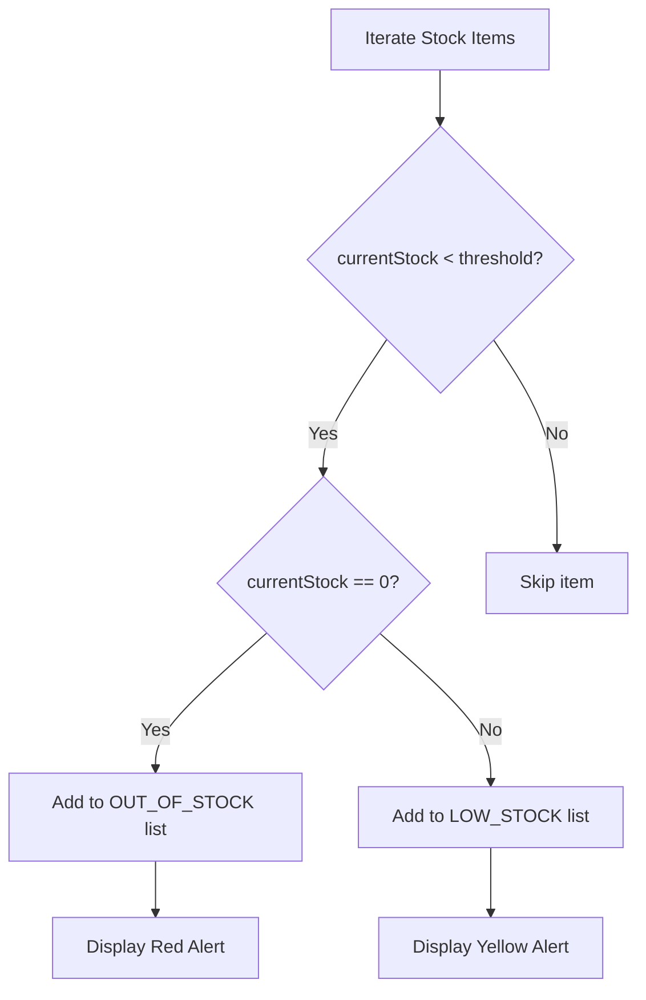

# Logika Bisnis: Dashboard

## 1. Kalkulasi Metrik

### Total Nilai Aset

```typescript
const totalValue = assets
  .filter((a) => !["DECOMMISSIONED", "CONSUMED"].includes(a.status))
  .reduce((sum, asset) => sum + (asset.purchasePrice || 0), 0);
```

### Status Distribution

```typescript
const statusCounts = {
  inStorage: assets.filter((a) => a.status === "Di Gudang").length,
  inUse: assets.filter((a) => a.status === "Digunakan").length,
  inCustody: assets.filter((a) => a.status === "Dipegang (Custody)").length,
  damaged: assets.filter((a) => ["Rusak", "Dalam Perbaikan"].includes(a.status))
    .length,
  outForRepair: assets.filter((a) => a.status === "Keluar (Service)").length,
};
```

### Spending Trend (6 Bulan)

```typescript
const getSpendingTrend = (assets: Asset[]) => {
  const months = [];
  const now = new Date();

  for (let i = 5; i >= 0; i--) {
    const month = new Date(now.getFullYear(), now.getMonth() - i, 1);
    const monthEnd = new Date(now.getFullYear(), now.getMonth() - i + 1, 0);

    const spending = assets
      .filter((a) => {
        const purchaseDate = new Date(a.purchaseDate);
        return purchaseDate >= month && purchaseDate <= monthEnd;
      })
      .reduce((sum, a) => sum + (a.purchasePrice || 0), 0);

    months.push({
      month: month.toLocaleDateString("id-ID", { month: "short" }),
      value: spending,
    });
  }

  return months;
};
```

## 2. Logika Stock Alert



### Threshold Logic

```typescript
const getThresholdForItem = (item: StockItem): number => {
  // Custom threshold jika sudah diset
  const key = `${item.name}|${item.brand}`;
  if (thresholds[key]) return thresholds[key];

  // Default berdasarkan tipe
  if (item.isMeasurement) {
    return DEFAULT_MEASUREMENT_THRESHOLD; // 2 unit (Hasbal/Drum)
  }
  return DEFAULT_UNIT_THRESHOLD; // 5 unit
};
```

## 3. Logika Actionable Items

### Definisi Actionable Item

Item yang memerlukan tindakan dari user berdasarkan role.

```typescript
interface ActionableItem {
  id: string;
  type: "request" | "loan" | "handover" | "repair" | "return";
  title: string;
  description: string;
  urgency: "high" | "medium" | "low";
  action: string; // Tombol aksi
  targetPage: Page;
}
```

### Filter per Role

#### Super Admin

```typescript
const getSuperAdminActions = () => [
  ...getRequestsAwaitingCEO(), // Request > 10jt menunggu
  ...getRequestsWithFollowUp(), // Request yang diminta update
  ...getOverdueLoanRequests(), // Peminjaman terlambat
  ...getPendingHandovers(), // Handover belum selesai
  ...getActiveRepairs(), // Perbaikan dalam proses
];
```

#### Admin Logistik

```typescript
const getLogistikActions = () => [
  ...getRequestsPendingLogisticApproval(),
  ...getArrivedRequestsToRegister(),
  ...getPendingHandovers(),
  ...getActiveRepairs(),
  ...getReturnsPendingVerification(),
];
```

#### Admin Purchase

```typescript
const getPurchaseActions = () => [
  ...getRequestsPendingPurchaseApproval(),
  ...getRequestsInProcurement(),
  ...getRequestsInDelivery(),
];
```

#### Staff/Leader

```typescript
const getStaffActions = () => [
  ...getMyPendingRequests(),
  ...getMyOverdueLoans(),
  ...getMyAssetsNeedingAction(),
];
```

## 4. Prioritas Urgency

```typescript
const calculateUrgency = (item: ActionableItem): "high" | "medium" | "low" => {
  // High: Memerlukan tindakan segera
  if (item.type === "loan" && isOverdue(item)) return "high";
  if (item.type === "request" && item.orderType === "Urgent") return "high";
  if (item.type === "repair" && daysSince(item.reportDate) > 7) return "high";

  // Medium: Perlu perhatian
  if (item.type === "request" && daysSince(item.requestDate) > 3)
    return "medium";
  if (item.type === "handover" && item.status === "PENDING") return "medium";

  // Low: Dapat ditangani nanti
  return "low";
};
```

## 5. Warranty Alert Logic

```typescript
const getWarrantyAlerts = (assets: Asset[]) => {
  const today = new Date();
  const thirtyDaysFromNow = new Date(today);
  thirtyDaysFromNow.setDate(today.getDate() + 30);

  return assets
    .filter((asset) => {
      if (!asset.warrantyEndDate) return false;
      const warrantyEnd = new Date(asset.warrantyEndDate);
      return warrantyEnd > today && warrantyEnd <= thirtyDaysFromNow;
    })
    .map((asset) => ({
      assetId: asset.id,
      assetName: asset.name,
      warrantyEndDate: asset.warrantyEndDate,
      daysRemaining: Math.ceil(
        (new Date(asset.warrantyEndDate) - today) / (1000 * 60 * 60 * 24),
      ),
    }));
};
```

## 6. Technician Leaderboard

```typescript
const getTechnicianLeaderboard = (installations: Installation[]) => {
  const counts = new Map<string, number>();

  // Count installations per technician
  installations
    .filter((i) => i.status === "Selesai")
    .forEach((i) => {
      const current = counts.get(i.technician) || 0;
      counts.set(i.technician, current + 1);
    });

  // Sort and take top 5
  return Array.from(counts.entries())
    .map(([name, count]) => ({ name, count }))
    .sort((a, b) => b.count - a.count)
    .slice(0, 5);
};
```

## 7. Refresh Strategy

### Auto-Refresh (Future Enhancement)

```typescript
// Polling setiap 5 menit untuk data terbaru
useEffect(() => {
  const interval = setInterval(
    () => {
      refreshDashboardData();
    },
    5 * 60 * 1000,
  );

  return () => clearInterval(interval);
}, []);
```

### Manual Refresh

```typescript
// User dapat trigger refresh manual
const handleRefresh = async () => {
  setIsRefreshing(true);
  await Promise.all([
    useAssetStore.getState().fetchAssets(),
    useRequestStore.getState().fetchRequests(),
    // ... other stores
  ]);
  setIsRefreshing(false);
};
```

## 8. Performance Optimization

### Memoization

```typescript
// Hindari kalkulasi berulang
const macroMetrics = useMemo(
  () => ({
    totalValue: calculateTotalValue(assets),
    totalAssets: assets.length,
    // ...
  }),
  [assets],
);
```

### Lazy Loading Charts

```typescript
// Load chart library hanya saat diperlukan
const ChartComponent = lazy(() => import('./DashboardCharts'));

// Render dengan Suspense
<Suspense fallback={<Skeleton height={200} />}>
    <ChartComponent data={chartData} />
</Suspense>
```

### Skeleton Loading

```typescript
if (isComputing) {
    return (
        <div className="p-8 space-y-8">
            <div className="grid grid-cols-4 gap-6">
                {[1,2,3,4].map(i => (
                    <Skeleton key={i} height={80} />
                ))}
            </div>
            <Skeleton height={200} />
        </div>
    );
}
```
