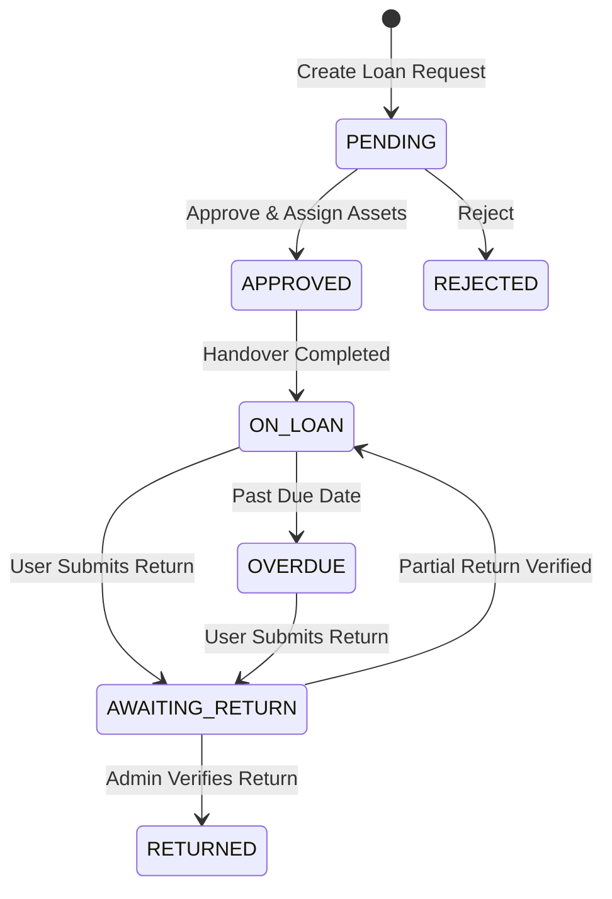

# Request Peminjaman (Loan)

## Status Lifecycle



## Business Rules

### BR-LOAN-001: Stok Availability Check

```
WHEN Admin assigns asset to loan
THEN system MUST verify asset.status == 'Di Gudang'
```

### BR-LOAN-002: Race Condition Prevention (Backend)

```
CRITICAL: Backend MUST implement optimistic/pessimistic locking
to prevent same asset being assigned to multiple loan requests
```

### BR-LOAN-003: Atomic Transaction (Backend)

```
Approval process MUST be atomic:
1. Update LoanRequest.status
2. Update Asset.status & Asset.currentUser
3. Create ActivityLog entries
All in single database transaction
```

### BR-LOAN-004: Overdue Detection

```
Daily cron job checks:
IF loanRequest.status == 'ON_LOAN'
   AND loanRequest.dueDate < TODAY
THEN set status = 'OVERDUE'
     AND notify requester & admin
```

### BR-LOAN-005: Partial Return

```
IF user returns some assets but not all
THEN status remains 'ON_LOAN' or 'AWAITING_RETURN'
     AND track returnedAssetIds[]

IF all assigned assets returned
THEN status = 'RETURNED'
```

## Alur Approval dengan Assignment

### Step 1: Admin Menerima Request

```
┌─────────────────────────────────────────────────────────────────┐
│ Loan Request LR-2026-005                                        │
├─────────────────────────────────────────────────────────────────┤
│ Pemohon: Jane Smith (NOC)                                       │
│ Tanggal: 15 Jan 2026                                           │
│                                                                 │
│ Items Requested:                                                │
│ ┌───────────────────────────────────────────────────────────┐  │
│ │ 1. Router Mikrotik x2                     [Assign Assets] │  │
│ │    - AST-2026-001 (RB750Gr3)             ☑                │  │
│ │    - AST-2026-002 (RB750Gr3)             ☑                │  │
│ │    - AST-2026-003 (RB750Gr3)             ☐                │  │
│ └───────────────────────────────────────────────────────────┘  │
│                                                                 │
│ [Approve & Assign]  [Reject]                                   │
└─────────────────────────────────────────────────────────────────┘
```

### Step 2: Asset Assignment Logic

```typescript
interface AssetAssignment {
    loanRequestId: string;
    assignments: Record<number, string[]>; // itemId -> assetIds[]
}

const processAssignment = async (data: AssetAssignment) => {
    // Validate all assets are available
    for (const [itemId, assetIds] of Object.entries(data.assignments)) {
        for (const assetId of assetIds) {
            const asset = await getAsset(assetId);
            if (asset.status !== 'Di Gudang') {
                throw new Error(`Asset ${assetId} tidak tersedia`);
            }
        }
    }

    // Begin transaction
    await db.transaction(async (tx) => {
        // Update loan request
        await tx.loanRequest.update({
            where: { id: data.loanRequestId },
            data: {
                status: 'APPROVED',
                assignedAssetIds: data.assignments,
                approver: currentUser.name,
                approvalDate: new Date()
            }
        });

        // Update each asset
        for (const assetIds of Object.values(data.assignments)) {
            for (const assetId of assetIds) {
                await tx.asset.update({
                    where: { id: assetId },
                    data: {
                        status: 'Dipegang (Custody)',
                        currentUser: requesterName
                    }
                });
            }
        }

        // Create activity logs
        await tx.activityLog.createMany({...});
    });
};
```

## Alur Pengembalian

### Step 1: User Submit Return Request

```typescript
interface ReturnSubmission {
  loanRequestId: string;
  items: Array<{
    assetId: string;
    returnedCondition: AssetCondition;
    notes?: string;
  }>;
}
```

### Step 2: Admin Verifikasi

```
┌─────────────────────────────────────────────────────────────────┐
│ Return Verification - LR-2026-005                               │
├─────────────────────────────────────────────────────────────────┤
│ Return Date: 20 Jan 2026                                        │
│ Returned By: Jane Smith                                         │
│                                                                 │
│ Items Returned:                                                 │
│ ┌───────────────────────────────────────────────────────────┐  │
│ │ 1. AST-2026-001 (Router Mikrotik RB750Gr3)                │  │
│ │    Kondisi: Baik ✓                    [Accept] [Reject]   │  │
│ │                                                           │  │
│ │ 2. AST-2026-002 (Router Mikrotik RB750Gr3)                │  │
│ │    Kondisi: Rusak Ringan              [Accept] [Reject]   │  │
│ │    Notes: "Antenna patah"                                 │  │
│ └───────────────────────────────────────────────────────────┘  │
│                                                                 │
│ [Verify All & Complete]                                        │
└─────────────────────────────────────────────────────────────────┘
```

### Step 3: Post-Verification Asset Update

```typescript
const processReturnVerification = async (data: ReturnVerification) => {
  for (const item of data.items) {
    if (item.verificationStatus === "ACCEPTED") {
      await updateAsset(item.assetId, {
        status: mapConditionToStatus(item.returnedCondition),
        currentUser: null,
        location: "Gudang",
      });
    } else {
      // Jika reject, perlu investigasi lebih lanjut
      await createInvestigationTicket(item);
    }
  }
};

const mapConditionToStatus = (condition: AssetCondition): AssetStatus => {
  switch (condition) {
    case "Baru":
    case "Baik":
    case "Bekas Layak Pakai":
      return "Di Gudang";
    case "Rusak Ringan":
    case "Rusak Berat":
      return "Rusak";
    case "Kanibal":
      return "Diberhentikan";
  }
};
```

## Edge Cases

### Case 1: Asset Rusak saat Dipinjam

```
IF returnedCondition is worse than original condition
THEN:
    1. Admin dapat menerima dengan catatan
    2. Sistem otomatis buat repair ticket
    3. Atau admin reject dan investigasi
```

### Case 2: Asset Hilang

```
IF user tidak dapat mengembalikan asset
THEN:
    1. Buat laporan kehilangan
    2. Notifikasi Super Admin
    3. Asset status = 'Diberhentikan'
    4. Proses HR/legal (di luar sistem)
```

### Case 3: Extend Loan Period

```
IF user perlu perpanjangan
THEN:
    1. Submit extension request (sebelum due date)
    2. Admin approve/reject extension
    3. Update due date jika approved
```

## Notifikasi

| Event             | Recipient         | Message                                    |
| ----------------- | ----------------- | ------------------------------------------ |
| Loan Created      | Admin             | "Request peminjaman baru dari {requester}" |
| Approved          | Requester         | "Peminjaman disetujui. Ambil di gudang."   |
| Rejected          | Requester         | "Peminjaman ditolak: {reason}"             |
| 3 Days Before Due | Requester         | "Pengingat: Kembalikan aset dalam 3 hari"  |
| 1 Day Before Due  | Requester         | "Pengingat: Kembalikan aset besok"         |
| Overdue           | Requester + Admin | "TERLAMBAT: Segera kembalikan aset"        |
| Return Submitted  | Admin             | "Pengembalian aset menunggu verifikasi"    |
| Return Verified   | Requester         | "Pengembalian telah diverifikasi"          |
