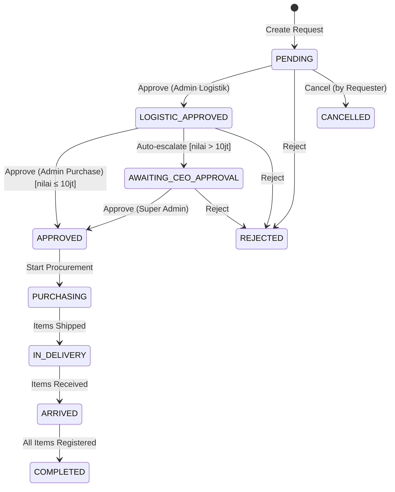

# Request Pengadaan (Procurement)

## Status Lifecycle



## Business Rules

### BR-REQ-001: Tipe Order per Role

```
Staff     → Hanya bisa memilih "Regular Stock"
Leader+   → Bisa memilih "Regular Stock", "Urgent", "Project Based"
```

### BR-REQ-002: Justifikasi Wajib

```
IF orderType == 'Urgent' OR orderType == 'Project Based'
THEN justification MUST be filled
```

### BR-REQ-003: Threshold CEO Approval

```
IF totalValue > 10.000.000
THEN status auto-escalate to AWAITING_CEO_APPROVAL after Purchase approves
```

### BR-REQ-004: Revisi Kuantitas

```
Approver dapat merevisi kuantitas per item:
- approvedQuantity < requestedQuantity (partial approval)
- approvedQuantity = 0 (reject item, wajib isi reason)
- approvedQuantity = requestedQuantity (full approval)
```

### BR-REQ-005: Cancel Policy

```
Request dapat dibatalkan oleh pemohon HANYA jika status == PENDING
```

## Alur Approval Detail

### Step 1: Admin Logistik Review

```typescript
interface LogisticApprovalPayload {
  requestId: string;
  decision: "approve" | "reject";
  itemStatuses: Record<
    number,
    {
      status: "approved" | "rejected" | "partial" | "stock_allocated";
      approvedQuantity?: number;
      reason?: string;
    }
  >;
  notes?: string;
}
```

**Aksi Tersedia:**

- ✅ Approve All - Setujui semua item
- ✅ Partial Approve - Revisi kuantitas per item
- ❌ Reject - Tolak dengan alasan
- 📦 Stock Allocate - Alokasi dari stok existing

### Step 2: Admin Purchase Review

```typescript
interface PurchaseApprovalPayload {
  requestId: string;
  decision: "approve" | "reject";
  purchaseDetails: Record<
    number,
    {
      purchasePrice: number;
      vendor: string;
      poNumber: string;
      invoiceNumber: string;
      purchaseDate: string;
      warrantyEndDate?: string;
    }
  >;
}
```

**Aksi Tersedia:**

- ✅ Approve & Input Purchase Details
- ❌ Reject

### Step 3: CEO Approval (jika applicable)

```typescript
interface CEOApprovalPayload {
  requestId: string;
  decision: "approve" | "reject";
  notes?: string;
}
```

**Aksi Tersedia:**

- ✅ Approve
- ❌ Reject
- 📌 Prioritize (tandai prioritas tinggi)
- 📝 Request Update (minta update progres)

## Tracking Procurement

### Status: PURCHASING

Admin Purchase menandai barang sedang dalam proses beli.

### Status: IN_DELIVERY

Admin Purchase menandai barang sudah dikirim.

```typescript
interface ShipmentUpdate {
  requestId: string;
  shipmentDate: string;
  trackingNumber?: string;
  estimatedArrival?: string;
}
```

### Status: ARRIVED

Admin Logistik mengkonfirmasi barang sudah tiba di gudang.

```typescript
interface ArrivalConfirmation {
  requestId: string;
  arrivalDate: string;
  receivedBy: string;
  notes?: string;
}
```

### Status: COMPLETED

Semua item sudah diregistrasi ke sistem aset.

## Validasi Form Request

```typescript
const validateRequest = (data: RequestFormData): ValidationResult => {
  const errors: string[] = [];

  // Items validation
  if (data.items.length === 0) {
    errors.push("Minimal 1 item harus dipilih");
  }

  data.items.forEach((item, idx) => {
    if (item.quantity < 1) {
      errors.push(`Item ${idx + 1}: Kuantitas minimal 1`);
    }
    if (!item.itemName) {
      errors.push(`Item ${idx + 1}: Nama item wajib diisi`);
    }
  });

  // Order type validation
  if (data.orderType === "Urgent" && !data.justification) {
    errors.push("Justifikasi wajib diisi untuk request Urgent");
  }

  if (data.orderType === "Project Based" && !data.project) {
    errors.push("Nama proyek wajib diisi untuk request Project Based");
  }

  return { isValid: errors.length === 0, errors };
};
```

## Notifikasi

| Event             | Recipient      | Message                                            |
| ----------------- | -------------- | -------------------------------------------------- |
| Request Created   | Admin Logistik | "Request baru dari {requester}"                    |
| Logistic Approved | Admin Purchase | "Request {id} menunggu persetujuan Purchase"       |
| Awaiting CEO      | Super Admin    | "Request {id} memerlukan persetujuan CEO (> 10jt)" |
| Approved          | Requester      | "Request {id} telah disetujui"                     |
| Rejected          | Requester      | "Request {id} ditolak: {reason}"                   |
| Arrived           | Requester      | "Barang request {id} sudah tiba"                   |
| Completed         | Requester      | "Request {id} telah selesai"                       |

## Export CSV

Header CSV:

```
No,Nomor Request,Pemohon,Divisi,Tanggal,Tipe,Status,Item,Kuantitas,Harga Satuan,Total,Vendor
```
