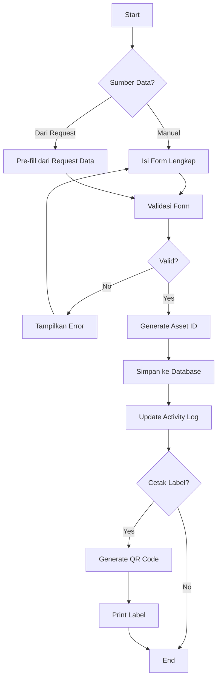
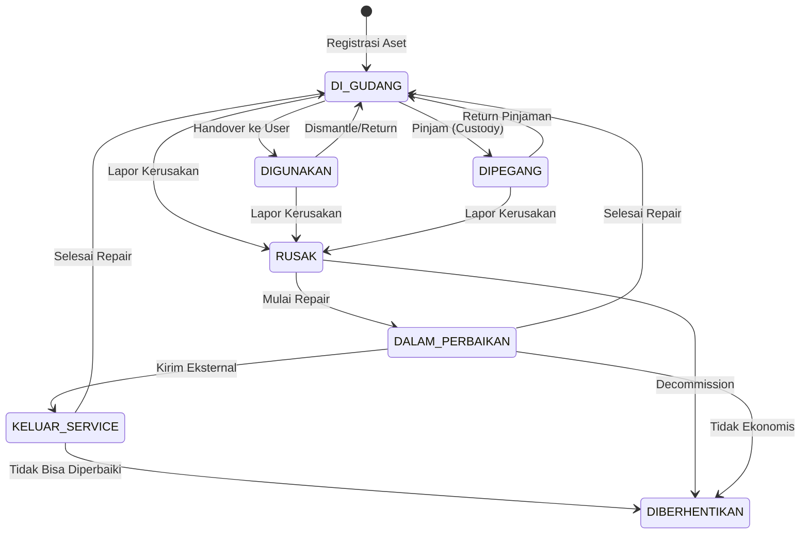

# Logika Bisnis: Registrasi Aset

## 1. Alur Registrasi



## 2. ID Generation Logic

```typescript
const generateAssetId = async (): Promise<string> => {
  const year = new Date().getFullYear();
  const prefix = `AST-${year}-`;

  // Get last ID for this year
  const lastAsset = await db.asset.findFirst({
    where: { id: { startsWith: prefix } },
    orderBy: { id: "desc" },
  });

  let nextNumber = 1;
  if (lastAsset) {
    const lastNumber = parseInt(lastAsset.id.split("-").pop() || "0");
    nextNumber = lastNumber + 1;
  }

  return `${prefix}${String(nextNumber).padStart(3, "0")}`;
};

// Output: AST-2026-001, AST-2026-002, ...
```

## 3. Validasi Form

```typescript
const validateAssetForm = (data: AssetFormData): ValidationResult => {
  const errors: Record<string, string> = {};

  // Required fields
  if (!data.name?.trim()) errors.name = "Nama aset wajib diisi";
  if (!data.category) errors.category = "Kategori wajib dipilih";
  if (!data.type) errors.type = "Tipe wajib dipilih";
  if (!data.brand) errors.brand = "Brand wajib dipilih";
  if (!data.condition) errors.condition = "Kondisi wajib dipilih";

  // Serial Number uniqueness (for individual assets)
  if (data.serialNumber && isSerialNumberExists(data.serialNumber)) {
    errors.serialNumber = "Serial Number sudah terdaftar";
  }

  // MAC Address format
  if (data.macAddress && !isValidMacAddress(data.macAddress)) {
    errors.macAddress = "Format MAC Address tidak valid";
  }

  // Purchase price validation
  if (data.purchasePrice !== undefined && data.purchasePrice < 0) {
    errors.purchasePrice = "Harga tidak boleh negatif";
  }

  // Warranty date logic
  if (data.warrantyEndDate && data.purchaseDate) {
    if (new Date(data.warrantyEndDate) < new Date(data.purchaseDate)) {
      errors.warrantyEndDate =
        "Tanggal garansi tidak boleh sebelum tanggal beli";
    }
  }

  return {
    isValid: Object.keys(errors).length === 0,
    errors,
  };
};
```

## 4. Bulk Asset Tracking

### Count-based Bulk

```typescript
interface BulkCountAsset {
  id: string;
  name: string;
  brand: string;
  quantity: number; // Jumlah unit
  status: AssetStatus;
}

// Contoh: Connector RJ45 (50 pcs)
const connectorAsset: BulkCountAsset = {
  id: "AST-2026-100",
  name: "Connector RJ45",
  brand: "AMP",
  quantity: 50,
  status: "Di Gudang",
};
```

### Measurement-based Bulk

```typescript
interface BulkMeasurementAsset {
  id: string;
  name: string;
  brand: string;
  initialBalance: number; // Kapasitas awal (1000m)
  currentBalance: number; // Sisa saat ini (850m)
  unitOfMeasure: string; // 'Meter'
  status: AssetStatus;
}

// Contoh: Kabel Fiber (1 Hasbal = 1000 Meter)
const cableAsset: BulkMeasurementAsset = {
  id: "AST-2026-101",
  name: "Kabel Fiber Dropcore 1C",
  brand: "Fiberhome",
  initialBalance: 1000,
  currentBalance: 850,
  unitOfMeasure: "Meter",
  status: "Di Gudang",
};
```

## 5. Import dari Request

```typescript
const importFromRequest = async (
  requestId: string,
  itemId: number,
): Promise<AssetFormData> => {
  const request = await getRequest(requestId);
  const item = request.items.find((i) => i.id === itemId);
  const purchaseDetail = request.purchaseDetails?.[itemId];

  return {
    // Pre-filled dari item request
    name: item.itemName,
    category: item.categoryId,
    type: item.typeId,
    brand: extractBrand(item.itemTypeBrand),

    // Pre-filled dari purchase details
    purchasePrice: purchaseDetail?.purchasePrice,
    purchaseDate: purchaseDetail?.purchaseDate,
    vendor: purchaseDetail?.vendor,
    poNumber: purchaseDetail?.poNumber,
    invoiceNumber: purchaseDetail?.invoiceNumber,
    warrantyEndDate: purchaseDetail?.warrantyEndDate,

    // Referensi ke request asal
    woRoIntNumber: request.id,

    // Fields yang perlu diisi manual
    serialNumber: null,
    macAddress: null,
    condition: "Baru",
    location: "Gudang",
  };
};
```

## 6. QR Code Generation

```typescript
interface QRCodeData {
  id: string; // Asset ID (wajib)
  sn?: string; // Serial Number (opsional)
  mac?: string; // MAC Address (opsional)
  name?: string; // Nama aset (untuk display)
}

const generateQRContent = (asset: Asset): string => {
  const data: QRCodeData = {
    id: asset.id,
    sn: asset.serialNumber || undefined,
    mac: asset.macAddress || undefined,
    name: asset.name,
  };

  // Format: JSON string
  return JSON.stringify(data);
};

// Output QR contains: {"id":"AST-2026-001","sn":"ABC123","name":"Router Mikrotik"}
```

### Label Template

```
┌─────────────────────────────┐
│ ┌─────────┐                 │
│ │   QR    │ AST-2026-001    │
│ │  Code   │                 │
│ └─────────┘ Router Mikrotik │
│             RB750Gr3        │
│             SN: ABC123456   │
│                             │
│ PT. Triniti Media Indonesia │
└─────────────────────────────┘
```

## 7. Activity Log

```typescript
const logAssetActivity = async (
  assetId: string,
  action: string,
  details: string,
  userId: number,
) => {
  await db.activityLog.create({
    data: {
      assetId,
      action,
      details,
      userId,
      timestamp: new Date(),
    },
  });
};

// Contoh entries:
// - "Aset dicatat" - saat registrasi
// - "Data diperbarui: Serial Number ditambahkan" - saat edit
// - "Status berubah: Di Gudang → Digunakan" - saat handover
// - "Lokasi berubah: Gudang A → Pelanggan X" - saat instalasi
```

## 8. Edit Asset

### Editable Fields

- Semua field kecuali ID
- Tracking history perubahan

### Audit Trail

```typescript
const updateAsset = async (
  id: string,
  changes: Partial<Asset>,
  userId: number,
) => {
  const oldAsset = await getAsset(id);

  // Find what changed
  const changedFields = Object.keys(changes).filter(
    (key) => oldAsset[key] !== changes[key],
  );

  // Update asset
  await db.asset.update({
    where: { id },
    data: {
      ...changes,
      lastModifiedDate: new Date(),
      lastModifiedBy: userId,
    },
  });

  // Log changes
  await logAssetActivity(
    id,
    "Data diperbarui",
    `Field yang berubah: ${changedFields.join(", ")}`,
    userId,
  );
};
```

## 9. Status Transitions


