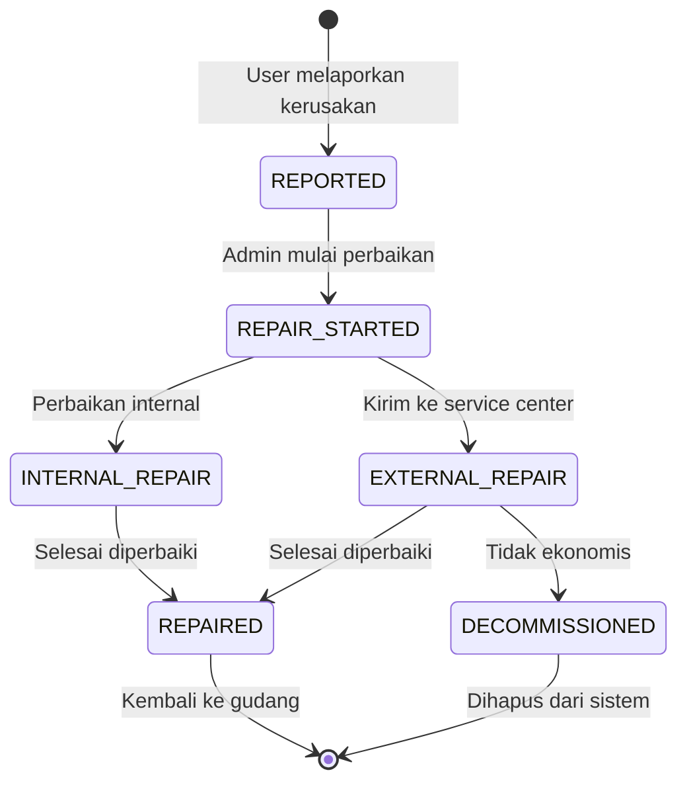

# Modul Perbaikan (Repair)

## Ringkasan

Modul ini menangani alur pelaporan kerusakan dan proses perbaikan aset, baik internal maupun eksternal (service center).

## Status Flow

## Fitur

1. **Laporan Kerusakan** - User melaporkan dengan deskripsi & foto
2. **Tracking Perbaikan** - Timeline progress perbaikan
3. **Service Center** - Tracking aset yang dikirim keluar
4. **Estimasi** - Biaya dan waktu perbaikan
5. **Decommission** - Penghapusan aset yang tidak bisa diperbaiki

## File Terkait

- `features/repair/RepairManagementPage.tsx`
- `stores/useAssetStore.ts` (repair-related actions)
